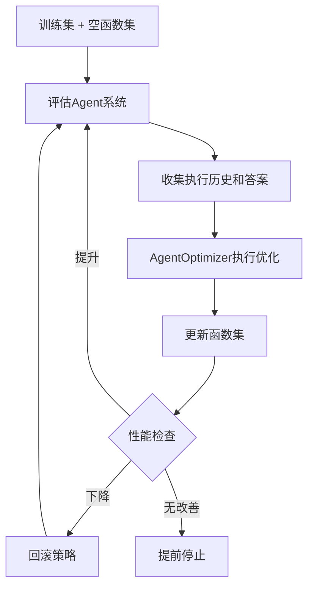

---
tags:
  - note
  - Agent
  - 语言模型
  - 强化学习
  - paper
creation date: 2025-08-19
modification date: 2025-08-19
owner: area/Agent
---
LLM(只能输出文本)
Agent（LLM（大脑）+tool（手脚眼睛）+记忆（记忆层））

## 核心思想

研究论文《Offline Training of Language Model Agents with Functions as Learnable Weights》提出了一种革命性的LLM Agent训练范式，核心理念是**不修改LLM权重来训练Agent**，而是将Agent的函数视为"可训练参数"。

> 💡 **类比启发**：受人类通过锻造工具来适应现实世界任务的启发，而非改变人类生物结构来适应静态工具

1. 我们的训练过程不是更新模型参数，而是更新LLM代理的函数，将它们视为代理的‘可训练参数’。
2. 我们的训练过程不是基于训练集计算损失，而是使用代理的执行历史和在训练任务上的表现作为更新代理函数的基础。
## 背景问题

### 传统方法的局限性

1. **手动函数创建**：用户需要手动为特定任务创建有用函数，过程耗时且需要多次迭代
2. **LLM黑匣子问题**：LLM意外地无法利用某些类型的函数
3. **微调成本高**：通过真实函数调用对LLM微调需要大量计算资源
4. **模型限制**：许多LLM模型是专有的，限制了微调的可行性

## AgentOptimizer：技术方案

### 核心架构对比

| 传统模型训练 | Agent训练 |
|------------|----------|
| 更新模型参数 | 更新Agent函数 |
| 使用训练集计算损失 | 使用执行历史和表现作为更新基础 |
| 模型权重为可训练参数 | 函数集为"可训练参数" |

### AgentOptimizer工作流程

### 函数操作动作

AgentOptimizer通过三种预定义操作逐步更新函数集：
- **添加（Add）**：引入新函数
	- 例如，为了执行添加功能 操作，LLM需要生成功能的名称、描述、代码等作为操作参数，以便在执行时，该操作将新功能添加到功能集中。
- **修改（Modify）**：改进现有函数
- **删除（Delete）**：移除无效函数

### 训练策略

#### 1. 回滚策略
- **触发条件**：训练集性能下降
- **操作**：撤销当前函数更新，回退到之前状态

#### 2. 提前停止策略
- **触发条件**：连续多个优化步骤无性能提升
- **操作**：终止优化过程

## 实验验证

### 测试任务
1. **数学推理**：MATH数据集，七种数据类型
2. **表格处理**：TabMWP任务
3. **一般现实世界任务**：GAIA数据集

## 技术优势

### 解决核心挑战
1. ✅ **无需LLM微调**：避免大量计算资源消耗
2. ✅ **适用专有模型**：不受模型开放性限制
3. ✅ **从零开始**：可从空函数集开始训练
4. ✅ **通用性强**：适用于多种任务类型

