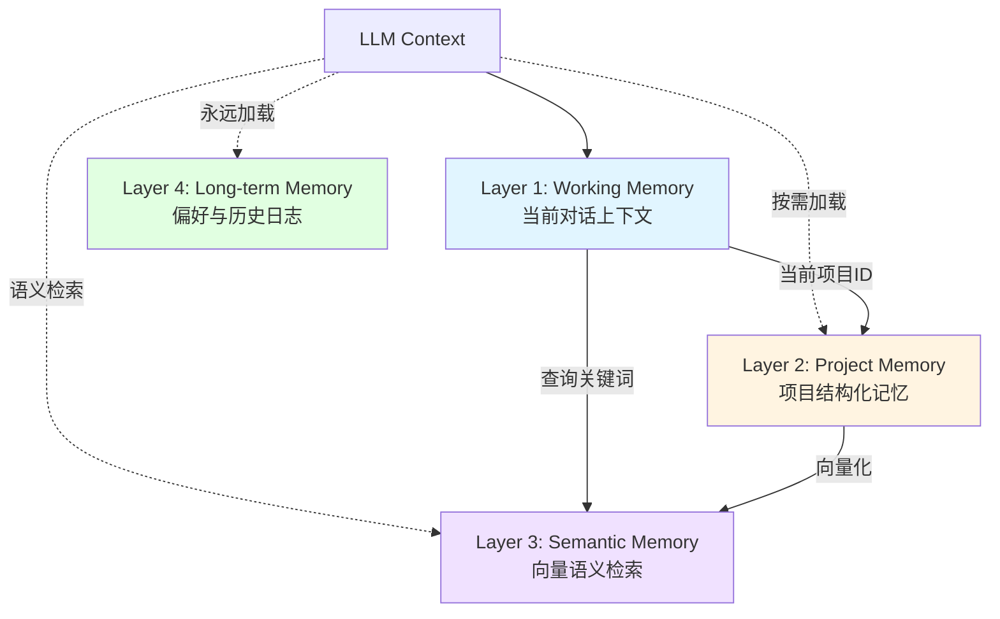

一个 AI 助手和一个真正的研究伙伴，最大的区别是什么？

是记忆。

普通助手的记忆是短暂的、扁平的。你问它一个问题，它回答。下次再问类似的问题，它可能还要从头解释一遍。它不记得你上周做的实验，不记得你三个月前读的论文，不记得你为什么放弃了某个技术路线。

研究伙伴的记忆是长期的、结构化的、关联的。它记得你的研究风格，记得项目的演进历程，记得每个决策的来龙去脉。你提到"那个用 attention 的实验"，它知道你说的是哪一个。你说"我想换个方法试试"，它能调出之前失败的方法，避免重复踩坑。

这就是我们要为 Herald 设计的记忆系统。

## 科研记忆的特殊性

科研工作的记忆需求和日常助理完全不同。

**超长时间跨度**。一个研究项目可能持续一两年。从最初的想法萌芽，到文献调研，到实验设计，到代码实现，到论文撰写，到投稿修改，到最终发表。整个过程中有无数个决策点，无数次试错，无数个"顿悟时刻"。这些都需要记录下来。不是为了归档，而是为了在未来的某个时刻，当我们需要回溯"为什么当时选了这个方案"时，能找到答案。

**高度结构化**。论文有固定的结构：Introduction、Related Work、Method、Experiments、Conclusion。实验有固定的要素：数据集、模型、超参数、评价指标、结果。每一篇论文都会引用其他论文，每一个实验都会基于前一个实验的结论。这些结构不是为了好看，而是承载了知识的组织方式。记忆系统必须理解这些结构，而不是把一切都当成纯文本。

**关联性强**。研究不是线性的。论文 A 启发了实验 B，实验 B 的结果写进了论文 C，论文 C 又引发了新的研究方向 D。一个想法可能在三个月后的另一个项目中被重新使用。一篇看似无关的论文可能在某个关键时刻提供了灵感。记忆不能是孤立的片段，而要是一张网，每个节点都和其他节点有联系。

**版本化**。研究的本质是不断推翻和迭代。今天的假设可能明天就被实验证伪。今天觉得最优的方案，下周可能发现有更好的。记忆系统不能只记录"最终结论"，而要记录整个演进过程。我们需要知道"我们曾经试过什么"，"为什么放弃了"，"现在的方案是怎么来的"。

这些特性决定了：科研记忆系统不是简单的"聊天历史记录"，而是一个复杂的知识管理系统。

## nanobot 的记忆：30 行代码的启示

我们先看看 nanobot 是怎么做的。

nanobot 的 `memory.py` 只有 30 行（去掉注释和空行）：

```python
class MemoryStore:
    """Two-layer memory: MEMORY.md + HISTORY.md"""
    def __init__(self, workspace: Path):
        self.memory_dir = ensure_dir(workspace / "memory")
        self.memory_file = self.memory_dir / "MEMORY.md"
        self.history_file = self.memory_dir / "HISTORY.md"

    def get_memory_context(self) -> str:
        long_term = self.read_long_term()
        return f"## Long-term Memory\n{long_term}" if long_term else ""
    
    def read_long_term(self) -> str:
        if self.memory_file.exists():
            return self.memory_file.read_text()
        return ""
    
    def append_history(self, entry: str):
        with open(self.history_file, "a") as f:
            timestamp = datetime.now().isoformat()
            f.write(f"[{timestamp}] {entry}\n")
```

就这些。两个文件：

- **MEMORY.md** — 长期记忆，存放用户偏好、重要信息、持久化的知识
- **HISTORY.md** — 历史记录，追加式日志，记录所有重要事件

每次 agent 启动时，读取 `MEMORY.md` 的内容，附加到系统提示里。每次有重要事件发生（完成任务、学到新知识、用户明确要求记住某事），就追加到 `HISTORY.md`。

这个设计简洁到极致。30 行代码，实现了两层记忆。对日常助手来说，完全够用。

它的优势是：
- **极简**：没有数据库，没有索引，没有向量搜索，就是两个 Markdown 文件
- **可读**：用户可以直接打开 `MEMORY.md` 查看和编辑，完全透明
- **可靠**：没有复杂的依赖，不会因为数据库挂掉而丢失记忆

但对科研场景，它有明显的不足：

- **无结构**：所有记忆都是纯文本，没有区分"这是一篇论文"、"这是一个实验"、"这是一个决策"
- **无索引**：无法快速检索"所有用了 attention 的实验"、"所有关于时序预测的论文"
- **无关联**：记忆是线性的、孤立的，看不出"实验 A 基于论文 B 的思路"
- **无版本**：只记录了"现在是什么"，看不到"曾经是什么"、"为什么变了"

这不是说 nanobot 的设计不好。对它的定位（日常助手）来说，这个设计是完美的。简洁即美。

但科研场景需要更多。

## Herald 四层记忆架构

我们设计了一个四层记忆架构：



### Layer 1: Working Memory（工作记忆）

这是最基础的一层，和 nanobot 的当前对话上下文一样。

**存储内容**：
- 当前对话的消息历史（最近 N 轮）
- 当前聚焦项目的关键信息（项目名、目标、当前阶段）
- 当前任务的上下文（正在做什么、为什么做、下一步是什么）

**生命周期**：短暂的，会话级别

**作用**：提供对话的连贯性。你提到"我刚才说的那个实验"，agent 需要从工作记忆里知道你说的是哪个。

这一层和 nanobot 一样，没有改动。

### Layer 2: Project Memory（项目记忆）

这是 Herald 的核心差异化能力。

科研工作是以项目为单位的。一个项目可能持续几个月甚至几年。项目有自己的目标、里程碑、论文、实验、决策、时间线。这些信息不应该散落在聊天历史里，而应该有结构化的存储。

**存储结构**：

```
memory/projects/{project_name}/
├── overview.md          # 项目概览（目标、背景、当前状态）
├── papers.jsonl         # 相关论文列表
├── experiments.jsonl    # 实验记录
├── decisions.md         # 重要决策日志
├── timeline.md          # 时间线
└── notes/               # 项目相关笔记
    ├── idea_001.md
    ├── experiment_analysis_002.md
    └── ...
```

**papers.jsonl** 每一行是一篇论文：

```json
{
  "id": "paper_001",
  "title": "Attention Is All You Need",
  "authors": ["Vaswani et al."],
  "venue": "NeurIPS 2017",
  "url": "https://arxiv.org/abs/1706.03762",
  "key_ideas": ["Multi-head attention", "Positional encoding", "No recurrence"],
  "relevance": "Core architecture for our model",
  "added_date": "2026-01-15",
  "tags": ["attention", "transformer", "architecture"]
}
```

**experiments.jsonl** 每一行是一个实验：

```json
{
  "id": "exp_012",
  "name": "Attention-based forecasting on ETTh1",
  "date": "2026-02-10",
  "dataset": "ETTh1",
  "model": "AttentionForecaster",
  "hyperparams": {"hidden_dim": 256, "num_heads": 8, "lr": 0.001},
  "results": {"mse": 0.342, "mae": 0.456},
  "baseline_comparison": {"mse": 0.389, "mae": 0.498},
  "conclusion": "Outperforms baseline by 12% on MSE",
  "code_path": "experiments/exp_012/",
  "notes": "Training was unstable, had to reduce learning rate"
}
```

**decisions.md** 记录重要决策：

```markdown
## 2026-02-08: 决定使用 Attention 而非 LSTM

经过对比实验（exp_008 vs exp_009），发现：
- Attention 在长序列上效果更好（MSE 0.35 vs 0.42）
- 但训练时间更长（2h vs 1h per epoch）
- 显存占用更大（8GB vs 4GB）

权衡后决定使用 Attention，因为我们的主要评价指标是预测精度。
训练时间可以通过分布式训练缓解，显存可以通过减小 batch size 解决。

相关实验：exp_008, exp_009
相关论文：paper_001 (Attention Is All You Need)
```

**项目间可交叉引用**：

```markdown
## 参考项目

本项目的时序预测模型架构借鉴了项目 [[Multivariate Time Series]] 中的经验，
特别是关于如何处理多变量输入的部分（见 decisions.md 2025-11-20）。
```

**按需加载策略**：

当用户切换到某个项目时，Herald 加载该项目的 `overview.md` 和最近的 `timeline.md`。当用户提到"之前的实验"时，Herald 从 `experiments.jsonl` 中检索相关实验。当用户提到"那篇论文"时，Herald 从 `papers.jsonl` 中查找。

这样，项目记忆不会全部塞进 context window，而是按需加载。

### Layer 3: Semantic Memory（语义记忆）

有了项目记忆，我们能够结构化地存储信息。但还有一个问题：**如何高效检索？**

假设我们有 10 个研究项目，每个项目 50 篇论文、100 个实验。当我问"有哪些论文用了 attention 做时序预测？"时，Herald 需要：

1. 遍历所有项目的 `papers.jsonl`
2. 检查每篇论文的 `key_ideas` 和 `tags`
3. 过滤出符合条件的

这种精确匹配效果有限。如果我问"有哪些论文用了自注意力机制做序列建模？"，而论文的 tags 里写的是"attention"而不是"自注意力"，就匹配不上了。

更糟糕的是，有些关联是隐含的。比如一篇论文讨论的是"multi-head scaled dot-product attention"，和"时序预测"完全没提，但它的思路可能对我们的问题有启发。传统的关键词匹配找不到这种关联。

这就需要语义检索。

**实现方案**：[QMD](https://github.com/tobi/qmd)（tobi/qmd）— 本地混合搜索引擎

QMD 结合了 BM25 全文搜索 + 向量语义搜索 + LLM 重排序，比纯向量数据库（如 ChromaDB、FAISS）更适合科研场景——我们经常需要精确匹配（论文标题、作者名）和语义匹配并存。QMD 的 collection 机制天然匹配项目记忆设计，每个研究项目一个 collection。通过 MCP 或 CLI 接入 Herald 非常方便。

我们把以下内容索引到 QMD：

- 所有论文的标题、摘要、key_ideas
- 所有实验的描述、结论、notes
- 所有项目笔记的内容
- 所有决策日志的内容

每个条目存储时附带元数据：

```python
{
    "type": "paper",  # paper | experiment | note | decision
    "project": "TimeSeriesForecasting",
    "id": "paper_001",
    "date": "2026-01-15",
    "tags": ["attention", "transformer"]
}
```

当用户提问时，Herald 可以：

```python
# 语义检索：找到所有和"attention 时序预测"相关的内容
results = chroma.query(
    query_texts=["attention mechanism for time series forecasting"],
    n_results=10,
    where={"type": {"$in": ["paper", "experiment"]}}
)
```

返回的不是精确匹配，而是语义相似的内容。即使论文里没有直接提"时序预测"，只要它讨论的 attention 机制在概念上相关，也能被检索到。

**与项目记忆的配合**：

项目记忆提供结构化存储，语义记忆提供高效检索。它们是互补的。

- 当我明确知道"我要看项目 A 的实验 012"，直接从项目记忆读取（精确、快速）
- 当我不确定"我之前好像看过类似的论文"，通过语义记忆检索（模糊、覆盖面广）

### Layer 4: Long-term Memory（长期记忆）

这一层和 nanobot 一样，保留 `MEMORY.md` 和 `HISTORY.md`。

**MEMORY.md** 存储：
- 用户的研究偏好（"我喜欢用 PyTorch，不喜欢用 TensorFlow"）
- 用户的写作风格（"我的论文倾向于简洁直接，避免过度修饰"）
- 用户的习惯（"我每天晚上 10 点后才有时间处理科研工作"）
- 通用知识（"ETTh1 数据集的标准划分是 12M train / 4M val / 4M test"）

**HISTORY.md** 存储：
- 所有重要事件的时间线日志（"2026-02-10: 完成实验 exp_012，首次在 ETTh1 上超过 baseline"）
- 跨项目的里程碑（"2026-01-20: 第一篇一作论文投稿到 NeurIPS"）

这一层永远加载到 context 中。它的内容不多（通常几千字），但很关键。它让 Herald 知道"你是谁"、"你的风格是什么"、"你经历过什么"。

## 上下文加载策略

有了四层记忆，还有一个关键问题：如何加载到 LLM 的 context window 中？

nanobot 的策略很简单：把所有东西都塞进系统提示。这对日常助手可行，因为记忆量不大。但对科研助手，这个策略会爆 context window。

我们采用分层加载策略：

```
┌─────────────────────────────────────────────┐
│ System Prompt（永远加载）                    │
│ - Herald 的身份、能力、目标                   │
│ - MEMORY.md（用户偏好、习惯）                │
│ - HISTORY.md（最近 50 条，更早的自动摘要）    │
└─────────────────────────────────────────────┘
              ↓
┌─────────────────────────────────────────────┐
│ Project Context（按项目加载）                │
│ - 当前聚焦项目的 overview.md                 │
│ - timeline.md（最近的里程碑）                │
│ - 最近 5 个实验的摘要                        │
│ - 最近 10 个决策                             │
└─────────────────────────────────────────────┘
              ↓
┌─────────────────────────────────────────────┐
│ Semantic Retrieval（按需检索）              │
│ - 根据当前对话主题，从 QMD 检索相关内容       │
│ - 最多 5 篇相关论文                          │
│ - 最多 5 个相关实验                          │
│ - 最多 3 篇相关笔记                          │
└─────────────────────────────────────────────┘
              ↓
┌─────────────────────────────────────────────┐
│ Working Memory（当前对话）                   │
│ - 最近 10 轮对话                             │
│ - 当前任务的上下文                           │
└─────────────────────────────────────────────┘
```

**动态调整**：

- 如果 context 快满了，优先丢弃语义检索的内容（因为不是核心上下文）
- 如果还不够，压缩项目上下文（只保留 overview，丢弃详细的实验和决策）
- 如果还不够，压缩工作记忆（只保留最近 5 轮对话）
- 永远不丢弃系统提示和长期记忆

**超长历史自动摘要**：

`HISTORY.md` 会随着时间无限增长。我们不能永远保留所有历史。

解决方案：定期摘要 + 分层存储

- **最近 7 天**：完整保留每一条
- **7-30 天**：每天摘要成一段
- **30-90 天**：每周摘要成一段
- **90 天以上**：每月摘要成一段

摘要由 LLM 生成，保留关键信息，丢弃无关细节。

## 小结

Herald 的四层记忆系统：

- **Layer 1 (Working Memory)**: 对话连贯性
- **Layer 2 (Project Memory)**: 结构化项目知识
- **Layer 3 (Semantic Memory)**: 语义检索能力
- **Layer 4 (Long-term Memory)**: 用户偏好与历史

这四层各司其职，互相配合，让 Herald 能够记住长达数月甚至数年的研究历程。

它不只是一个"聊天机器人 + 聊天历史"。它是一个真正有记忆的研究伙伴。

下一篇：[[Herald — 改造蓝图与开发路线]]，我们会讲如何基于 nanobot 实现 Herald，以及分阶段的开发计划。
