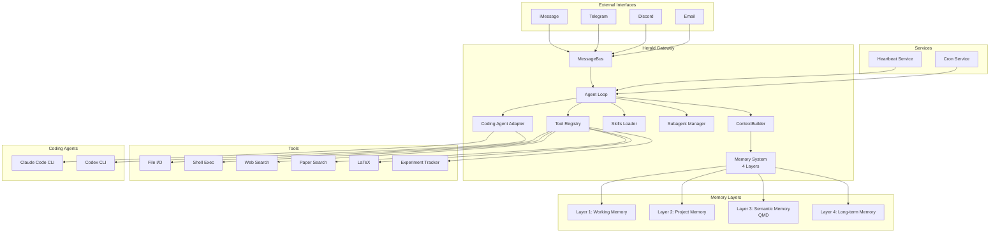

技术选型是项目的第一个关键决策。选错了，后面会很痛苦；选对了，开发会顺畅很多。我们花了不少时间思考三个核心问题：基于什么项目改造？用不用 agent 框架？用什么技术栈？

## 路径选择：从零写 vs 基于现有项目

我们面前有三条路：

**路径 A：基于 netclode 改造**  
netclode 的基础设施很强大（K8s + MicroVM + JuiceFS），但它的定位是 coding agent，不是通用 agent。如果要改成科研助手，需要：
- 新增记忆系统（netclode 没有）
- 新增 heartbeat 主动机制（netclode 没有）
- 新增 skill 生态（netclode 没有）
- 从 Go/TypeScript 迁移到 Python（科研生态）

这几乎等于在 netclode 的基础设施上重写一个新系统。而且 K8s 对我们来说太重了，我们不需要多租户、不需要 MicroVM 隔离（就我们自己用）。

**路径 B：基于 nanobot 改造**  
nanobot 的定位和 Herald 高度重合（个人助手 → 科研助手），架构清晰（AgentLoop、MessageBus、Subagent 都有），代码量小（~9100 行，容易理解和修改），Python 生态（科研工具都是 Python）。

需要改的：
- 记忆系统（从 30 行扩展到四层架构）
- 工具系统（新增科研专用工具）
- Channel 层（精简，只保留需要的）

这些改动都是"加法"，不需要推倒重来。

**路径 C：从零写**  
完全从零写一个 agent 系统，工作量太大，而且没必要。nanobot 的 AgentLoop、MessageBus、ToolRegistry 这些核心组件设计得很好，我们没必要重新发明轮子。

**结论：基于 nanobot 改造。**

## 为什么不用 LangChain / LangGraph？

这是第二个重要决策。很多人做 AI agent 会首选 LangChain 或 LangGraph，但我们决定不用任何框架，自己写轻量 agent loop。

### 关键观察：三个项目都没用框架

我们研究的三个项目（nanobot、netclode、OpenClaw）**都没有用任何 agent 框架**。

- nanobot：自己写的 AgentLoop，476 行
- netclode：自己写的 SDK 适配层
- OpenClaw：自己写的 agent 循环

这不是巧合。这说明 agent loop 本身并不复杂，框架反而引入了不必要的抽象层。

### Agent loop 到底有多简单？

我们仔细读了 nanobot 的 `AgentLoop` 代码，发现核心逻辑就是：

```python
while not done:
    # 1. 构建上下文
    context = build_context(memory, current_message)
    
    # 2. 调用 LLM
    response = llm.complete(context)
    
    # 3. 解析返回
    if response.is_text():
        return response.text
    elif response.is_tool_call():
        # 4. 执行工具
        result = execute_tool(response.tool_name, response.tool_args)
        # 5. 将结果反馈给 LLM
        context.append(result)
    
    done = check_if_done(response)
```

就这么简单。476 行代码，包含了完整的错误处理、token 管理、并发控制。

### 框架的问题

LangChain/LangGraph 引入了大量抽象层：

- `Chain`、`Agent`、`Tool`、`Memory`、`Callback` 等概念
- 每个概念都有自己的接口和生命周期
- 调试困难（你不知道框架内部在干什么）
- 定制困难（想改一个小逻辑，得理解整个框架）

而 agent loop 本身不复杂，我们需要的是**精确控制**：

- Token 管理（科研场景经常需要处理长文档）
- 错误处理（某个工具调用失败时的恢复策略）
- 中断恢复（session 被暂停后如何恢复）
- 上下文加载策略（按需加载，而不是全部塞进 prompt）

这些都需要精确控制每一步，框架反而是障碍。

### 承璋的编程偏好

承璋的编程哲学：**MVP 优先，严禁过度工程化。**

先做一个最小可行产品，验证核心假设，再逐步迭代。不要一开始就引入复杂的框架、复杂的架构。

476 行代码就能实现一个 agent loop，为什么要引入一个几万行的框架？

**结论：不用框架，自己写轻量 agent loop。**

## 技术栈

确定了基于 nanobot 改造、不用框架之后，技术栈就很清晰了：

| 层级 | 选择 | 理由 |
|------|------|------|
| **语言** | Python 3.11+ | 承璋最熟悉、科研生态最好 |
| **LLM 接口** | LiteLLM | 统一模型接口，任意 provider（OpenAI/Anthropic/本地模型） |
| **异步** | asyncio | Python 原生异步，适合 I/O 密集型任务 |
| **语义搜索** | QMD (tobi/qmd) | BM25 + 向量搜索 + LLM 重排序，本地混合搜索引擎 |
| **配置管理** | Pydantic | 类型安全的配置和数据模型 |

### 为什么选 QMD？

语义记忆需要检索能力。纯向量数据库（ChromaDB、FAISS）只能做语义匹配，但科研场景经常需要精确匹配和语义匹配并存——比如搜论文标题要精确，搜相关方法要语义。

QMD 是一个本地混合搜索引擎，结合了 BM25 全文搜索、向量语义搜索和 LLM 重排序三层检索。它的 collection 机制天然匹配我们的项目记忆设计（每个研究项目一个 collection），而且支持 MCP 协议，可以直接接入 Herald 的工具系统。OpenClaw 已经在用 QMD 作为记忆检索后端，效果已验证。

## 整体架构



### 核心组件说明

**MessageBus**：消息总线，所有外部消息（Telegram/Discord/Email）都经过这里。

**Agent Loop**：核心循环，处理"LLM → tool call → result → LLM"。

**ContextBuilder**：构建上下文。不是把所有东西塞进 system prompt，而是按需加载：
- 永远加载身份信息（你是 Herald，科研 AI 伙伴）
- 按项目加载当前上下文（当前聚焦的论文、实验）
- 按需从向量库检索（相关文献、历史实验）

**Memory System**：四层记忆架构（详见 [[Herald — 四层记忆系统设计]]）。

**Tool Registry**：工具注册表。基础工具（文件、Shell、Web）+ 科研工具（文献搜索、论文解析、LaTeX、实验跟踪）。

**Coding Agent Adapter**：外部 coding agent 适配层（详见 [[Herald — 代码能力与 Coding Agent 集成]]）。

**Heartbeat Service**：主动机制，定期检查：
- 新论文（arXiv、Google Scholar）
- Citation alert（你的论文被引用了）
- 实验进度（长时间运行的实验）

**Cron Service**：定时任务，例如每周总结、每月文献综述。

## 部署架构

我们的部署很简单（不需要 K8s、不需要 MicroVM）：

```
pci-3 (物理机)
├── Herald Gateway (Python)
├── QMD (本地混合搜索引擎)
├── Claude Code CLI
├── Codex CLI
└── Project Workspaces
    ├── project-a/
    ├── project-b/
    └── ...
```

所有东西跑在一台机器上。如果后续需要扩展，可以：
- QMD 通过 HTTP MCP 独立部署
- Coding Agent 放在独立的沙箱里（参考 netclode 的设计）

但 MVP 阶段，简单就好。

## 技术决策总结

| 决策点 | 选择 | 理由 |
|--------|------|------|
| **基础** | 基于 nanobot 改造 | 定位重合、轻量级、Python 生态 |
| **框架** | 不用 LangChain/LangGraph | Agent loop 不复杂，自己写更可控 |
| **语言** | Python 3.11+ | 科研生态最好、承璋最熟悉 |
| **LLM** | LiteLLM | 统一接口、任意 provider |
| **语义搜索** | QMD | BM25 + 向量 + LLM 重排序，本地混合搜索 |
| **异步** | asyncio | Python 原生、适合 I/O 密集 |
| **Coding** | 外部 agent（Claude Code/Codex） | 不重造轮子、调用成熟方案 |

下一步：[[Herald — 改造蓝图与开发路线]]。
