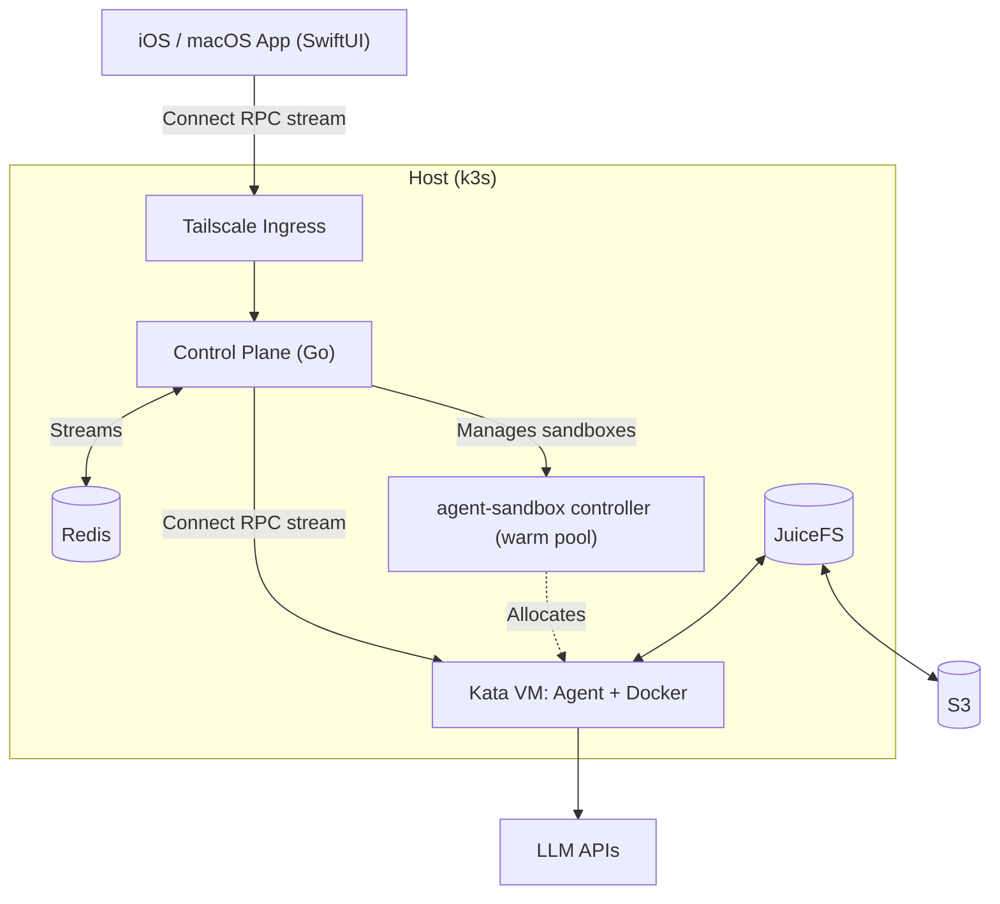
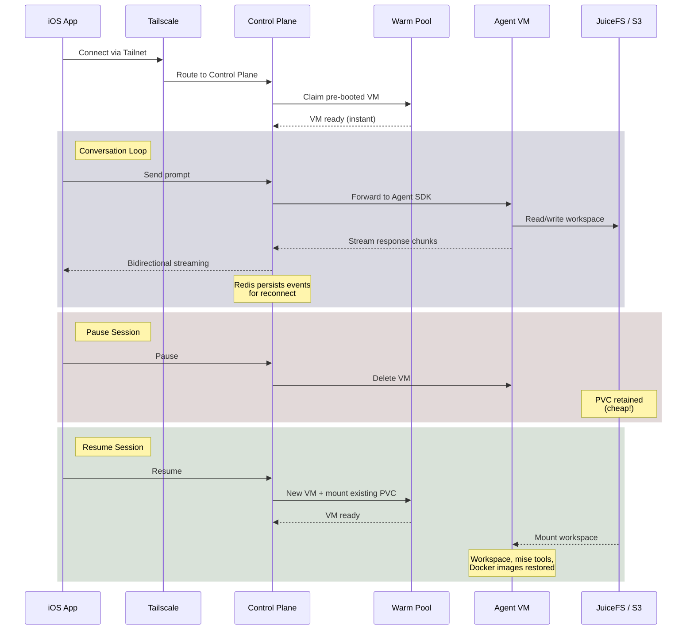
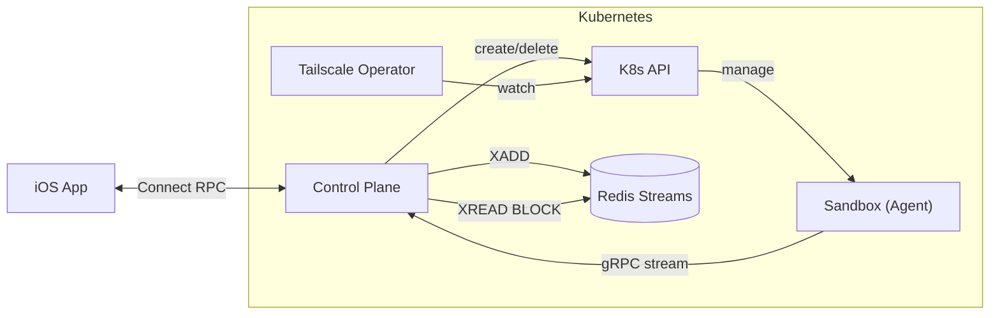
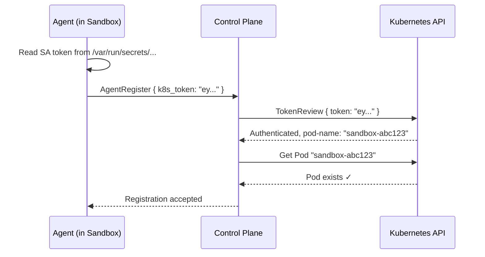
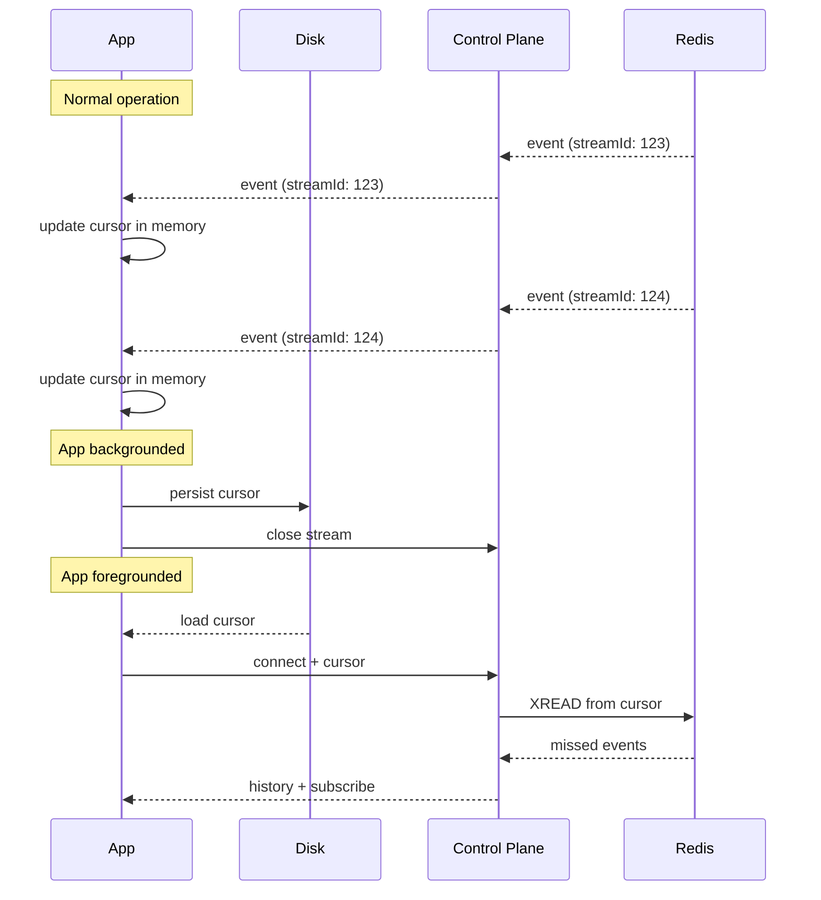
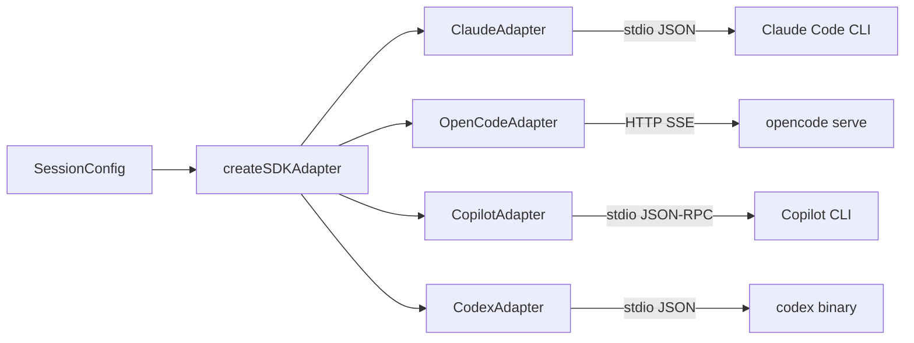
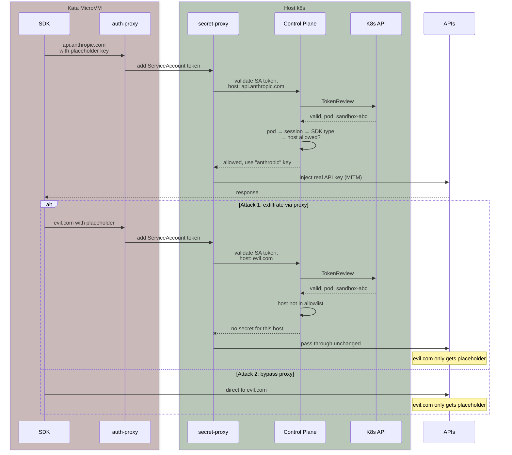

最近我一直在开发 [Netclode](https://github.com/angristan/netclode)，过程非常有趣!项目涉及很多有意思的技术点,我觉得值得分享一下。

## 使用场景

我的很多项目灵感都来自远离键盘的时刻:跑步时、通勤路上、旅行途中等等。通常我会在 Notion 里记下想法、设置提醒,或者在移动端与 LLM 进行头脑风暴。

和 ChatGPT 这类工具头脑风暴的问题在于,我需要给它提供上下文。虽然可以给它 GitHub 仓库的 URL,但它的代码探索能力远不如真正的 coding agent,而且它无法进行修改、创建 PR 等操作。

市面上虽然有一些云端 coding agent 服务,但我试用后觉得有些令人失望……所以我决定自己做一个!这既能解决我的实际需求,开发过程本身也很有意思。顺便我还给一些开源项目提交了贡献! [^1]

[^1]: 原文脚注,作者在开发过程中向开源社区做出了贡献

## Netclode 简介

[Netclode](https://github.com/angristan/netclode) 是一个自托管的远程 coding agent,基于 Kubernetes 和 microVM（微虚拟机）沙箱构建,支持多种 coding agent SDK,可以通过精心设计的原生 iOS app 使用,并通过 Tailscale 进行安全访问。

[iOS app](https://github.com/angristan/netclode/tree/master/clients/ios) 支持任意后端,[Ansible playbook](https://github.com/angristan/netclode/tree/master/infra/ansible) 让你可以一键部署自己的服务器,所以你也可以自己试试。

![[netclode-article/ios-netclode.png]]
*远程、自托管的云端 coding agent,功能强大且体验出色!*

### 技术栈

这个项目让我有机会使用一些我最喜欢的技术:[k3s](https://stanislas.blog/2025/04/moving-to-k8s/)、[Tailscale](https://stanislas.blog/2021/08/tailscale/)、[microVMs](https://stanislas.blog/2021/08/firecracker/)、[JuiceFS](https://x.com/fuolpit/status/2016163986031452524)、[SwiftUI](https://github.com/angristan?tab=repositories&q=swiftui&type=source&language=&sort=)、[Ansible](https://github.com/angristan/ansible-roles)、Redis……

给你一个技术栈概览:

| Layer | Technology | Purpose |
|-------|------------|---------|
| Host | Linux VPS + Ansible | 通过 playbook 自动化部署 |
| Orchestration | k3s | 轻量级 Kubernetes,适合单节点 |
| Isolation | Kata Containers + Cloud Hypervisor | 每个 agent session 运行在独立 MicroVM 中 |
| Storage | JuiceFS → S3 | 对象存储支持的 POSIX 文件系统 |
| State | Redis (Streams) | 实时流式 session 状态 |
| Network | Tailscale Operator | VPN 访问主机、ingress、sandbox 预览 |
| API | Protobuf + Connect RPC | 类型安全、类 gRPC、支持流式传输 |
| Control Plane | Go | Session 和 sandbox 编排 |
| Agent | TypeScript/Node.js | sandbox 内运行的 SDK (Claude Code, OpenCode 等) |
| Client | SwiftUI (iOS 26) | 原生 iOS/macOS app |
| CLI | Go | 开发调试客户端 |
| Local LLM | Ollama | 可选的本地 GPU 推理 |

### 亮点功能

首先,它底层使用了优秀的 coding agent harness,我没有重复造轮子。它支持 Claude Code、Codex、OpenCode 和 Copilot。内置 GitHub 集成,可以在启动 session 时克隆 GitHub 仓库,可选择提供写入权限以便 agent 推送代码。App 中还有 git diff 视图。

在基础设施方面,session 运行在 microVM 内部的沙箱中。这让我可以给 agent 完整的 sudo 权限和运行中的 Docker daemon,使 agent 能够完成几乎任何任务。

Session 的状态和存储都在 JuiceFS 持久卷上。这样我可以按需暂停和恢复 session,暂停时计算资源消耗为零,只保留存储(成本极低)。还解锁了一些很酷的功能,比如按回合快照,可以将整个状态(不仅是 git)恢复到之前的任意时间点。

Tailscale 集成意味着我只能从我的 Tailnet 内访问 control plane。我还可以做一些有趣的事情,比如在 tailnet 中导出 sandbox 端口,访问 sandbox 内运行的 Web 服务器。还可以选择性地让 session 访问我的 tailnet,如果我想疯狂一点,甚至可以用 Netclode 控制 Netclode。:D

而且因为它运行在我自己的硬件上,我可以通过 Ollama 实验本地 LLM,实现完全私密的推理。

## 现有云端 coding agent 的不足

虽然开发 Netclode 很有趣,但我之所以想自己做,确实是因为我对现有的云端 coding agent 感到失望。

### Copilot

Copilot 有两种模式,但对我的使用场景都不太适用。

**Copilot Chat**:首先,如果你关闭 app 或标签页,甚至只是切换到另一个聊天,对话就会……失败,打破了"对话在后台持续进行"这一几乎所有 LLM 聊天都具备的基本假设?

![[netclode-article/copilot-chat-failed.webp]]
*如果聊天没有保持打开状态(即使在同一标签页内切换聊天也会这样!),就会出现这种情况*

其次,它无法运行命令。所以功能比较基础,只能做代码搜索和 Web 搜索。

要真正**运行**命令,你需要 Copilot Agent。但 Copilot Agent 对我来说不可用,因为**每一个 prompt**、**每一个 session** 都会创建一个 PR,无论如何都避免不了。

例如:

![[netclode-article/copilot-agent-pr.webp]]
*谢谢,我真的很需要[这个空 PR](https://github.com/angristan/fast-resume/pull/11)*

Agent 本身其实很好,在上面的例子中,它能够搞清楚 uv 和 python 的设置并成功运行测试!但为什么我每个 prompt 都要一个 `+0 −0` 的草稿 PR?而且 PR 无法删除,这只会让我的仓库变得混乱 🤨。对于某些场景,比如我确实想让 agent 提交 PR 时,原生的 GitHub 集成很棒。但由于它不是可选的:这是致命缺陷!

### Codex web

Codex 模型和 [Codex CLI](https://github.com/openai/codex) 是 S 级的,与 Claude Opus 和 Claude Code 处于同一水平。但 [Codex web](https://developers.openai.com/codex/cloud/) 却令人意外地落后。

Codex web 面向的是"请求变更",而不是真正的规划、讨论或通过对话完成任务。

在 iOS 上,功能只是一个子集:你只能看到 agent 工作的摘要(在 web 上可以看到完整内容,但隐藏在点击后面)。

而且可能是模型和 harness 的组合问题,它真的非常懒:

![[netclode-article/codex-cloud-ios-tests.webp]]
*就这些,这就是全部 UI。我看不到它做了什么*

模型在沙箱里,可以做任何事,但就是不做。你必须要求它做所有事情(安装语言、工具、依赖,运行这个等等)。对我来说,这无法用于移动办公或头脑风暴。UX 真的不适合这种场景!

### Claude Code web

Web 上的 Claude Code 是目前最好的。Web 和 iOS 的 UX 都很好,你有好的模型和可以安装一切的沙箱,Claude Code harness 也真的很优秀!

![[netclode-article/claude-code-web-fast-resume-tests.webp]]
*Claude Code web 运行 fast-resume 测试*

我仍然遇到了一些问题,因为 agent 以 root 身份运行,有时会导致问题(如上例)。它更像是一个构建时模型,语言是预装的。虽然它可以自己安装东西(从 APT、互联网……),因为它有完整访问权限,但真的需要引导才会这么做。(Codex 有 [mise](https://github.com/jdx/mise)……虽然它不用,因为它很懒)。

### 对比演示:Netclode vs 其他方案

就上面的例子,运行我的 [fast-resume TUI](https://github.com/angristan/fast-resume) 测试,Netclode 成功了,因为它能搞清楚如何安装 uv 并且不以 root 身份运行!

![[netclode-article/netclode-fast-resume-tests.webp]]
*成功!*

再来一个更复杂的例子,在 [Larafeed,我的 RSS 阅读器 web app](https://github.com/angristan/larafeed) 中运行测试,它是用 Laravel 构建的。我要求运行测试,因为这能展示 agent 是否理解项目上下文(哪种语言、哪些工具)以及是否会主动采取行动达成目标。

- **Copilot**:我不想要无用的 PR,所以我甚至不打算试
- **Codex**:安装 NPM 依赖(?),然后运行 PHP linting(?),而[明明有一个叫 `test` 的 composer script](https://github.com/angristan/larafeed/blob/128ba0dc3aae2d6b8433cefc726ea776574c60fa/composer.json#L76)

![[netclode-article/codex-web-larafeed-tests.webp]]
*令人失望*

- **Claude**:使用 PHP 8.4,而项目是 PHP 8.5,所以它开始将我的项目降级到 8.4(?)。然后在我反复坚持后,它从 APT 仓库安装了 PHP 8.5,并将设置改为使用 SQLite,尽管我的项目是围绕 Postgres 设计的。所以大部分测试通过了,但远非全部。在另一个 session 中,它自己想到了执行 `service postgresql start`,因为 PostgreSQL 实际上是预装的。但在这次它没有。

![[netclode-article/claude-code-web-larafeed-tests.webp]]
*Claude code:将我的项目降级到 PHP 8.4 并试图用 SQLite 替换 PostgreSQL*

- **Netclode**(使用 Claude Code 和 Opus 4.5)可以用 mise 安装 PHP 8.5 并用 APT 安装 Postgres,但由于我在 sandbox 中有一个 Docker daemon 在运行,它直接使用 Docker 就成功了!

![[netclode-article/netclode-larafeed-tests.webp]]
*多亏了内置的 Docker 取得了巨大成功!有点慢是因为当时我的服务器有点不堪重负*

### 通过 SSH 在手机上使用 Claude Code

必须回答的问题:"为什么不通过终端 SSH 使用 Claude?"

我可以在自己的服务器或电脑上部署 Tailscale、Claude Code 等,然后通过手机上的 SSH 访问,但这种 UX 不太好,在手机上管理多个 session、清理、仓库等也不是很方便。我想要更移动友好的东西。但各有所爱!

有个叫 [Happy](https://github.com/slopus/happy) 的项目很酷,实现了从 iOS app 到电脑的端到端加密 session、通知等功能,但 session 需要事先手动启动。它很酷,但 UX 更接近远程 Claude Code 而不是云 coding agent。

## Netclode 深度技术解析

我认为 Netclode 有不少有趣的功能和实现细节,让我们深入了解一下。

### 架构



发送 prompt 时,control plane 从 warm pool 中抓取一个预启动的 Kata VM(所以是即时的),将消息转发给内部的 agent service,调用 coding agent SDK 并实时流式返回响应。事件持久化在 Redis Streams 中,客户端可以随时重新连接而不丢失任何内容。

暂停 session 时,VM 被删除,但 JuiceFS 卷保留在 S3 中,包含所有工作区状态、已安装的工具和 Docker 数据。恢复时,新 VM 挂载相同的存储,对话像什么都没发生一样继续。

![[netclode-article/netclode-k9s.png]]
*[k9s](https://k9scli.io/) 中的 k8s pods 概览*

架构目前本质上是单租户的,但通过 k3s 以及状态在 k8s/Redis 中 + 存储卸载到 S3 配合 JuiceFS,可以轻松扩展到多台计算机(k3s 节点)来同时运行更多沙箱。



### 选择沙箱运行时

有一篇很好的 [AI 沙箱概览文章](https://www.luiscardoso.dev/blog/sandboxes-for-ai),如果你想了解更多选项。我需要完全隔离,所以选择了 [Kata Containers](https://katacontainers.io/) 配合 [Cloud Hypervisor](https://www.cloudhypervisor.org/)。

我没选 [gVisor](https://gvisor.dev/),因为它在用户空间拦截系统调用而不是使用 KVM,所以隔离模型不同。我的理解是它大概能工作,但在里面运行 Docker 会更困难一些。它可能可以工作,但我没有理由不用 Kata,所以没有尝试那条路。

回到 2021 年,当我[使用 Firecracker 执行不受信任的代码](https://stanislas.blog/2021/08/firecracker/)时,我很享受构建自己的编排器,包括 warm pooling 并直接处理 VMM。Firecracker 很棒,但它不支持 [virtiofs](https://virtio-fs.gitlab.io/),所以你不能直接挂载目录到 VM,而需要使用块设备,这更复杂。我还想要 PCI passthrough 以便后续可能的本地 GPU 推理。Cloud Hypervisor + virtiofs 完美适配我的使用场景!

Kata 也支持 [QEMU](https://www.qemu.org/),但对于我感兴趣的功能集,Cloud Hypervisor 更轻量。使用 QEMU 除了支持 virtiofs 的 [DAX](https://lwn.net/Articles/813807/) 来减少页面缓存的 RAM 使用外,我得不到任何好处,但这不值得额外的重量。

#### Kata Containers 和 microVM

[Kata Containers](https://katacontainers.io/) 是一个容器运行时,它让每个 pod 运行在自己的轻量级 VM 中,由 KVM 支持,而不只是使用 Linux namespace。所以你得到的是真正的硬件级隔离,而不仅仅是 cgroup 和 namespace。从 Kubernetes 的角度看,它就像一个普通的 pod,但底层是一个有自己内核的完整 VM。

![[netclode-article/kata-containers.png]]
*Kata Containers 架构*

嵌套一开始有点令人困惑:你有一个 Kubernetes pod,它包含一个 microVM(Cloud Hypervisor),里面又包含一个或多个容器。Pod 的资源请求/限制与 VM 的实际资源(由 Kata 处理)是分开的。容器使用 runc 运行并由 [containerd](https://containerd.io/) 管理,就像标准 k8s 一样,但中间有一个 microVM。

这就是为什么我可以用 `privileged: true` 运行容器[而没有安全顾虑](https://github.com/kata-containers/kata-containers/blob/main/docs/how-to/privileged.md)。Privileged 只授予 VM 内核内的 root 权限,而不是主机。通常,privileged 容器可以访问主机设备。使用 Kata 时,containerd 配置有 `privileged_without_host_devices=true`,所以这些都不会传递到 VM 中。即使有东西逃逸出容器,它仍然被困在 VM 内,无法访问主机硬件。(至少理论上如此)

这让我可以在沙箱内运行 Docker,对 agent 启动数据库、开发服务器等非常有用。

除了 VM 隔离,我还使用 [NetworkPolicies](https://kubernetes.io/docs/concepts/services-networking/network-policies/) 来限制沙箱可以访问的内容。它们无法与其他沙箱或集群服务通信。基础模板只允许访问 control plane、DNS 和 Ollama:

```yaml
egress:
  - to:
    - podSelector:
        matchLabels:
          app: control-plane
  - to:
    - namespaceSelector:
        matchLabels:
          kubernetes.io/metadata.name: kube-system
    ports:
    - protocol: UDP
      port: 53
  - to:
    - podSelector:
        matchLabels:
          app: ollama
```

互联网访问通过单独的 NetworkPolicy 在沙箱启动时添加(agent 需要调用 LLM API)。我排除了私有范围,所以它们仍然无法访问集群服务:

```yaml
egress:
  - to:
    - ipBlock:
        cidr: 0.0.0.0/0
        except:
        - 10.0.0.0/8
        - 172.16.0.0/12
        - 192.168.0.0/16
```

#### 资源配置

每个沙箱 VM [默认](https://github.com/angristan/netclode/blob/09ab9444f08df98c0e41ffa07c1425b0156fa53e/.env.example#L41-L42)获得 4 vCPU 和 4GB RAM,在 Kata 的配置中设置。大多数时候,我的使用是突发性的,不会用完全部资源。为了能够运行比理论限制更多的 pod,我添加了一个超额配置比率(可通过 `CPU_OVERCOMMIT_RATIO` 和 `MEMORY_OVERCOMMIT_RATIO` 配置)。例如,4x 比率下,一个 4-CPU VM 只向 k8s 调度器请求 1 CPU,允许在节点上打包 4 倍于调度器认为可以处理的 pod 数量。

除了 VM 的资源,还有主机侧进程的开销:VMM(Cloud Hypervisor)、vhost workers、virtiofsd daemon 和 kata-shim。当启用 `sandbox_cgroup_only=true` 时,这些在 pod 的 cgroup 中运行。RuntimeClass 将此开销声明为 500m CPU + 512Mi 内存,所以 k8s 调度器在节点上放置 pod 时会考虑它。

为了优化内存,我通过 balloon 启用了内存回收:当 VM 内的容器释放内存时,[virtio-balloon](https://blog.pmhahn.de/virtio-balloon/) 设备将这些空闲页面报告回主机。主机然后可以为其他 VM 或进程回收它们。

单个 pod 也可以通过注释如 `io.katacontainers.config.hypervisor.default_vcpus` 覆盖 kata 资源。这在 iOS 和 control plane 中实现了。

为防止单个 session 使用所有资源,control plane 强制限制单个 session 最多使用主机资源的 50%。

> 📹 原文视频:[从 iOS app 配置沙箱 CPU 和内存。自定义沙箱无法使用 warm pool,因此第二个显示 Creating 状态](视频链接)

### Agent-sandbox

我本来准备再次[手撸自己的编排器](https://github.com/codebench-dev/worker),但我想看看能否利用 k3s,[我过去一年一直在用它](https://stanislas.blog/2025/04/moving-to-k8s/)。我很高兴地了解到 [agent-sandbox](https://github.com/kubernetes-sigs/agent-sandbox) 被创建为一个抽象层来在 Kubernetes 中管理沙箱。它提供了比原生 Kube 资源更匹配 Sandbox 语义的[自定义资源](https://kubernetes.io/docs/concepts/extend-kubernetes/api-extension/custom-resources/):

- **Sandbox**:提供稳定的主机名/网络标识、持久存储、生命周期管理
- **SandboxClaim**:沙箱请求(可以从 warm pool 满足)
- **SandboxTemplate**:claim 的 pod spec + PVC 模板
- **SandboxWarmPool**:维护 N 个预启动的 VM,准备即时分配

我能够很好地将它与我的 control plane 集成。[Warm pool,我在自己的 Firecracker 编排器中也使用的模式](https://stanislas.blog/2021/08/firecracker/),非常棒,因为它大大减少了启动 session 的延迟。唯一的延迟是克隆仓库和用 SDK 引导 agent,这大约需要一秒钟。

> 📹 原文视频:[无冷启动!k9s 中创建的 pod 是下一个 session 的新 warm pool。终止的 pod 是自动暂停的 session](视频链接)

不幸的是,当前的 agent-sandbox [不支持 SandboxTemplate 的 volumeClaimTemplates](https://github.com/kubernetes-sigs/agent-sandbox/issues/225),这意味着你不能在 warm pool 中拥有预创建卷的沙箱,而这正是我需要的。我有[一个待审查的 PR](https://github.com/kubernetes-sigs/agent-sandbox/pull/240) 来添加这个功能,希望能被合并!🤞 到目前为止,我得到了维护者 Vicente 非常彻底的审查。

看起来 [Google 是 agent-sandbox 的发起者](https://cloud.google.com/blog/products/containers-kubernetes/agentic-ai-on-kubernetes-and-gke),他们提供了使用 gVisor 作为运行时的 GKE Sandbox 产品。

现在,有些人会说使用 k8s 作为沙箱编排器[是个坏主意](https://x.com/mishushakov/status/2015873993085981153),可能有充分的理由,但这至少是一种相当优雅的管理沙箱的方式。无论如何,我不是在寻求非常强的安全性,因为这是单租户服务,我主要对具有更多能力的隔离环境感兴趣(比如嵌入式 Docker daemon)。

### JuiceFS 存储

两份工作前我在对象存储公司工作时,经常对基于 S3 的文件系统进行基准测试。[JuiceFS](https://juicefs.com/en/) 是目前为止最可靠、性能最好的一个。我甚至在它上面运行过多 TB 的沙箱。

JuiceFS 是一个符合 POSIX 的分布式文件系统,使用专用的元数据存储(我用 Redis)并将数据块存储在 S3 上。它支持本地读缓存以避免对 S3 的往返读取。它比仅依赖 S3 的基于 FUSE 的文件系统复杂得多,但性能更好且可扩展性更强。

哦,[他们当年在我做了一点点贡献后给我寄了件 T 恤](https://x.com/fuolpit/status/2016163986031452524)!

![[netclode-article/juicefs-architecture.webp]]
*我使用 Kubernetes CSI、Redis 和 DigitalOcean Spaces*

对于 Netclode,JuiceFS 的价值在于它将存储与计算解耦。沙箱是有状态的工作流,所以我确保尽可能多地将内容存储在持久卷上:

```
/agent/ # JuiceFS volume
├── workspace/ # User's code (agent's cwd)
├── docker/ # Docker data
├── .local/share/mise/ # Installed tools (persistent)
├── .cache/ # Package caches
├── .claude/ # SDK session data
└── .session-mapping.json # Session ID mapping
```

这样,我可以激进地暂停 session(意味着实际删除 pod)并恢复它们而不会丢失任何数据。暂停的 session 非常便宜:计算变为免费,存储只是任何对象存储提供商。我不必担心主机磁盘空间耗尽。当达到 `MAX_ACTIVE_SESSIONS` 限制(默认 5)时,control plane 自动暂停最旧的非活动 session。

> 📹 原文视频:[暂停 session 删除 pod。恢复 session 重新创建 pod 并重新分配 PV。所有状态都回来了!](视频链接)

在多节点设置中,这也意味着恢复的沙箱可以被调度到与初始不同的节点上。

![[netclode-article/juicefs-csi.webp]]
*JuiceFS CSI Driver*

缺点是它降低了 virtiofs 的 IOPS 性能 😟 虽然足够好,但这是一个可以改进的领域,以真正达到 NVMe SSD 级别的 IOPS。目前我至少启用了 [writeback](https://juicefs.com/en/blog/solutions/juicefs-write-acceleration),因为在最坏情况下数据丢失是可以接受的。

#### 写时复制快照

由于 JuiceFS 将元数据与数据块分开存储,它支持[写时复制克隆](https://juicefs.com/docs/community/guide/clone/)。当你克隆一个目录时,只复制元数据,原始和克隆都引用相同的底层 S3 块。当任一被修改时,只有更改的块被复制。这意味着快照几乎是即时的,无论大小如何,存储只用于实际差异。

在每个 agent 回合后,control plane 创建 agent 持久卷的 Kubernetes [VolumeSnapshot](https://kubernetes.io/docs/concepts/storage/volume-snapshots/)。当你想要回滚时:

- 旧 PVC 被孤立,agent pod 被删除
- 从快照创建新 PVC
- 消息和事件被截断以匹配快照点
- 新 VM 挂载恢复的卷
- Session 以旧状态重启

工作区、已安装工具、Docker 镜像和 SDK session 都被恢复。这有点像更轻量的 [CRIU](https://criu.org/Main_Page),虽然完整的内存检查点会更好,相当酷。

每个 session 最多保留 10 个快照。创建新快照时,最旧的会自动删除。

> 📹 原文视频:[恢复后,我们找回了所有数据,包括 session 状态本身](视频链接)

> 📹 原文视频:[删除 session 时,所有快照通过 CSI 删除](视频链接)

### 失败的 Nix 实验

[我用 Nix 已经有一段时间了](https://github.com/angristan/nixos-config),但我记得 [Replit](https://replit.com/),基本上就是为生计运行 coding 沙箱的公司,几年前迁移到了 Nix:

- [All New Repls are Powered By Nix](https://blog.replit.com/powered-by-nix)
- [How we went from supporting 50 languages to all of them](https://blog.replit.com/nix)
- [Faster Nix Repl Startup](https://blog.replit.com/nix-perf-improvements)

他们通过利用共享的 Nix 缓存和 derivations 来避免将所有编程语言和工具打包到一个巨大的 Docker 镜像中。我也想要这个!

我的方法是在主机上运行 NixOS,使用 nix-daemon,在 JuiceFS 上使用 chroot store。每个沙箱会在 `/nix/store` 只读挂载 store,并通过 vsock 与主机 daemon 通信。想法是我们下载一次包,下次所有沙箱都可以使用它。

```
┌────────────────────────────────────────────────────────────┐
│ HOST                                                       │
│                                                            │
│ nix-daemon ◄─────► /nix/store (JuiceFS)                  │
│ ▲                 │                                        │
│ ──────┼──────────────────────┼─────────────────────────────│
│       │                      │                            │
│       │ vsock (install)      │ mount /nix/store (read)    │
│       │                      ▼                            │
│ ┌────┴──────────────────────────┐                        │
│ │ Kata VMs                       │                        │
│ └───────────────────────────────┘                        │
└────────────────────────────────────────────────────────────┘
```

我让它工作了,但遇到了两个主要问题:

首先,在 `/nix/store` 上挂载 JuiceFS store 会隐藏容器镜像本身内置的包(bash、nodejs 等)。我尝试了 overlay 挂载、启动时将镜像包复制到 JuiceFS、构建静态二进制文件……都没有很好地工作,这并不奇怪,这有点蠢。

其次,nixpkgs 评估很慢。当你运行 `nix shell nixpkgs#python3` 时,Nix 必须解析数千个 `.nix` 文件来解析 derivation。这需要 1-2 分钟,而评估缓存位于每个沙箱的 `~/.cache/nix/` 中,所以每个沙箱都要支付这个成本。二进制缓存只对构建步骤有帮助,对评估没有帮助。我考虑过通过 JuiceFS 在沙箱间共享评估缓存,但它使用 SQLite,所以并发写访问基本上会出问题。预计算 derivations 可以工作,但 nixpkgs 很庞大:Replit 的预构建缓存[增长到 20TB](https://blog.replit.com/tvix-store),对我的规模来说不值得。

很有趣,但我最终回到了 [mise](https://mise.jdx.dev/)。它足够好了,因为我使用的是相当主流的语言(Node、Python、Go、Rust)。Agent 仍然可以使用 APT 安装其他东西。

我很确定仍然有办法让它正常工作,我只是对 Nix 不够熟悉,无法让它运行良好。

### GitHub 访问

默认情况下,沙箱没有提供 GitHub token。如果我只是想聊天,这没问题,我可以这样克隆我的公开仓库。

但有时我想处理私有仓库,或者能够从沙箱做贡献。

我的[方法](https://github.com/angristan/netclode/blob/master/docs/github-integration.md)是使用我创建的 GitHub App,范围限定到我的所有仓库,从 control plane 即时生成 token。选择仓库时:

- Token 只限定到那个仓库
- 可以是只读或读写
- Token 在运行时传递给 agent(并配置为与 git 和 gh 一起工作)

这样沙箱只能访问它需要的内容。我还可以为运行中的 session 更新 token,例如以只读开始,如果我想推送东西,可以切换。

我还添加了多仓库支持,因为我经常在单个 session 中做跨仓库工作,有时只是为了有参考,有时是在多个位置做更改。在这种情况下,token 限定到所有仓库。

> 📹 原文视频:[读写访问也可以在 session 期间添加](视频链接)

> 📹 原文视频:[Netclode 可以同时处理 2 个或更多仓库。系统提示会更新,让它知道哪些仓库在哪里可用](视频链接)

### [Control Plane](https://github.com/angristan/netclode/tree/master/services/control-plane)

Control plane 用 Go 编写,负责:

- Session 生命周期(创建、暂停、恢复、删除)
- Kubernetes 资源管理(Sandbox CRD、PVC、Service、NetworkPolicy)
- 客户端和 agent 之间的双向流式传输
- Session、消息、事件的 Redis 持久化
- 带 PTY 管理的终端代理
- 通过 Tailscale Service 暴露端口



#### Agent 认证

Agent 需要在连接到 control plane 时证明其身份。为了避免 agent 冒充另一个并提取 token,它们使用 Kubernetes ServiceAccount token 进行认证:



#### Proto 数据模型和 Redis 持久化

所有[数据模型都在 Protobuf 中定义](https://github.com/angristan/netclode/tree/master/proto/netclode/v1),这为我提供了 Go、TypeScript 和 Swift 的类型安全生成代码。

由于这个项目是单租户的,数据模型非常简单:

- **Session**:id、name、status、repo、sdk_type、model、pvc_name
- **AgentEvent**:消息、工具调用、思考块、终端输出等的类型化 payload
- **Snapshot**:id、turn_number、message_count、stream_id(恢复的游标)

Redis 作为数据库非常完美。我们只需要几个数据结构:

- `session:{id}` - HASH,包含 session 元数据(name、status、timestamp、PVC name、消息计数)
- `sessions:all` - SET,索引所有 session ID
- `session:{id}:stream` - STREAM,所有 session 数据
- `session:{id}:snapshots` - SORTED SET,按创建时间排序的快照 ID
- `session:{id}:snapshot:{snapId}` - HASH,包含快照元数据

与 agent 的交互很好地匹配基于事件的模型,所以这是 [Redis Streams](https://redis.io/docs/latest/develop/data-types/streams/) 的完美用例。Session 的所有内容都进入 `session:{id}:stream`:事件、消息、终端输出、状态更新。

每个条目有一致的结构:

```protobuf
message StreamEntry {
  string id = 1;
  google.protobuf.Timestamp timestamp = 2;
  bool partial = 3; // true = streaming delta, false = final

  oneof payload {
    AgentEvent event = 4;
    TerminalOutput terminal_output = 5;
    Session session_update = 6;
    Error error = 7;
  }
}
```

大多数条目是 `AgentEvent`,它有自己的 kind:

```protobuf
enum AgentEventKind {
  AGENT_EVENT_KIND_MESSAGE = 1; // User or assistant message
  AGENT_EVENT_KIND_THINKING = 2; // Agent reasoning
  AGENT_EVENT_KIND_TOOL_START = 3; // Tool invocation started
  AGENT_EVENT_KIND_TOOL_INPUT = 4; // Tool input
  AGENT_EVENT_KIND_TOOL_OUTPUT = 5; // Tool output
  AGENT_EVENT_KIND_TOOL_END = 6; // Tool execution completed
  AGENT_EVENT_KIND_PORT_EXPOSED = 7; // Port exposed for preview
  AGENT_EVENT_KIND_REPO_CLONE = 8; // Repository clone progress
  // ...
}
```

`partial` 字段处理流式增量。当 agent 流式传输文本或工具输出时,每个块都用 `partial: true` 写入。完成时,写入 `partial: false` 的最终条目。打开 session 时,客户端接收仅过滤到 `partial: false` 条目的历史记录,加上包含未完成流式传输的任何累积内容的 `inProgress` 状态。从那里,订阅流式传输所有内容,包括 partial。

模型序列化为 JSON 以便于调试,但理论上我可以序列化为 protobuf 以节省空间。

#### Redis Streams 实时同步

处理客户端重连而不丢失数据可能很棘手。使用经典 pub/sub,你可以在获取历史记录之前订阅以避免丢失条目,但你需要处理去重。

Redis Streams 使这更简单。每个条目都有唯一 ID 并且它们是持久化的,所以你可以从任何点读取。当客户端打开 session 时,它发送其 `lastStreamId`(或"0"表示完整历史记录)。Control plane 从该游标执行 `XREAD`,然后保持连接打开,用 `XREAD BLOCK` 等待新条目。重连时,客户端发送其最后看到的 ID 并从那里继续。多个客户端可以用自己的游标订阅同一 session,所以我可以同时在手机和 Mac 上打开同一 session。



> 📹 原文视频:[一个小的 redis-cli MONITOR 显示 session 期间的 streams 活动](视频链接)

#### 崩溃恢复和协调

当 control plane 重启(崩溃、部署等)时,它在 Redis 和 Kubernetes 之间协调 session 状态。它从 Redis 加载所有 session,列出实际运行的沙箱,并同步状态:

- 运行中的 session 但没有沙箱 → 标记为 `INTERRUPTED`(崩溃时 agent 正在处理)
- 创建中的 session 但沙箱已就绪 → 标记为 `READY`(崩溃前创建完成)
- 沙箱存在但未就绪 → 标记为 `PAUSED`(无法与其通信)
- 没有沙箱 → 标记为 `PAUSED`(VM 已停止)

这防止 session 在重启后卡住。

### Connect RPC

我最初用 WebSocket 上的 JSON 进行 app-to-control-plane 通信的 PoC,agent-to-control-plane 用 REST + SSE,然后终端流式传输又用 WebSocket。

我想统一一切,因为这都是实时和事件驱动的。Buf 的 [Connect RPC](https://connectrpc.com/) 非常完美:它兼容 gRPC,有双向流式传输,并为 Go、TypeScript 和 Swift 生成客户端。如果我决定做 web app,我可以使用 Connect,而我不能只用 gRPC。

所有通信使用单个双向流。客户端发送消息(创建 session、发送 prompt、终端输入),服务器流式返回响应(事件、文本增量、终端输出)。这非常容易推理,特别是对于 Redis Streams 的状态管理。

我只有两个[流式 RPC](https://connectrpc.com/docs/protocol#streaming-rpcs):[ClientService.Connect](https://github.com/angristan/netclode/blob/e2abc609163ff038b8779259463b6baed6e7440e/proto/netclode/v1/client.proto#L13) 用于客户端,[AgentService.Connect](https://github.com/angristan/netclode/blob/e2abc609163ff038b8779259463b6baed6e7440e/proto/netclode/v1/agent.proto#L12) 用于 agent。其他一切都是这些流上的消息。

我喜欢能够[定义 proto](https://github.com/angristan/netclode/tree/master/proto) 并在各处获得类型安全的客户端:

```protobuf
service ClientService {
  rpc Connect(stream ClientMessage) returns (stream ServerMessage);
}

message ClientMessage {
  oneof message {
    CreateSessionRequest create_session = 1;
    SendPromptRequest send_prompt = 2;
    TerminalInputRequest terminal_input = 3;
    // ... 18 more message types
  }
}
```

然后从 Swift 使用它很直接:

```swift
// Create the client from generated code
let client = Netclode_V1_ClientServiceClient(client: httpClient)
let stream = client.connect(headers: [:])

// Send a message
var msg = Netclode_V1_ClientMessage()
var req = Netclode_V1_SendPromptRequest()
req.sessionID = sessionId
req.text = "run the tests"
msg.message = .sendPrompt(req)
try await stream.send(msg)

// Receive responses
for await result in stream.results() {
  switch result {
  case .message(let serverMessage):
    // Handle streaming response
  }
}
```

#### Buf 代码生成

对于代码生成,我使用 [Buf](https://buf.build/)。我不必考虑 protoc 插件,只需用一个简单的[配置文件](https://github.com/angristan/netclode/blob/master/proto/buf.gen.yaml)生成我需要的一切:

```yaml
plugins:
  - remote: buf.build/protocolbuffers/go
    out: ../services/control-plane/gen
  - remote: buf.build/connectrpc/go
    out: ../services/control-plane/gen
  - remote: buf.build/bufbuild/es:v2.2.0
    out: ../services/agent/gen
    opt: [target=ts]
  - remote: buf.build/apple/swift
    out: ../clients/ios/Netclode/Generated
  - remote: buf.build/connectrpc/swift
    out: ../clients/ios/Netclode/Generated
```

然后用 `buf generate` 我从相同的 proto 文件获得 Go 结构、TypeScript 类型和 Swift 类。Connect 插件还生成类型化的服务客户端。

Buf 最近发布了 [Protobuf 语言服务器](https://buf.build/blog/protobuf-lsp)!我[给 OpenCode 开了一个 PR](https://github.com/anomalyco/opencode/pull/10075) 来添加对它的支持。

#### Tailscale h2c 问题

Netclode 不暴露到互联网,只能在 tailnet 内访问。

我必须部署自己版本的 Tailscale 代理来使用双向 Connect 流。Tailscale 在代理中硬编码了 gRPC content-type 检查,这破坏了我的用例的 h2c(HTTP/2 明文),因为 Connect 使用 `application/connect+proto` 而不是 `application/grpc`。

我[开了一个 PR 来修复上游](https://github.com/tailscale/tailscale/pull/18484)。

### 通过 Tailscale 的私有 Web 预览

在处理网页或 web app 时,在本地运行并测试它很容易。当云 agent 在沙箱中运行时,就不那么明显了。提供商不提供访问沙箱内部内容的解决方案。

[Simon Willison 使用 GitHub Pages](https://til.simonwillison.net/claude-code/preview-github-pages) 预览正在构建的内容,因为没有办法直接访问沙箱。但这仅限于静态网站。如果你想要更复杂的 app,你必须为 PR 上的自动部署设置自己的托管提供商。

有了 Netclode,我可以直接通过 Tailscale 访问我的沙箱!我使用 [Tailscale Kubernetes Operator](https://tailscale.com/kb/1236/kubernetes-operator) 将沙箱端口暴露到我的 tailnet。

沙箱启动时,control plane 创建一个带 Tailscale 注释的 Kubernetes Service。当我从 app 请求暴露一个端口(比如开发服务器的端口 3000)时,control plane 将端口添加到 Service:

```yaml
apiVersion: v1
kind: Service
metadata:
  name: ts-abc123
  annotations:
    tailscale.com/expose: "true"
    tailscale.com/hostname: sandbox-abc123
spec:
  selector:
    # Points to the sandbox pod
  ports:
    - name: preview-3000
      port: 3000
```

Tailscale Operator 监视这些注释,为服务配置 Tailscale 设备,并在 MagicDNS 中注册它。Control plane 还更新沙箱的 NetworkPolicy 以允许来自 tailscale namespace 的入站流量。预览 URL 最终是 `http://sandbox-abc123.tail12345.ts.net:3000`,可从我 tailnet 上的任何设备访问。

当 session 暂停或删除时,control plane 删除 Kubernetes Service,Tailscale Operator 自动从我的 tailnet 中删除设备。没有过时的机器堵塞管理控制台,我们也保持在免费层限制内。

> 📹 原文视频:[将沙箱端口暴露到 tailnet 并从 Safari 访问它](视频链接)

### 从沙箱访问 Tailnet

可选地,沙箱可以访问 `100.64.0.0/10` Tailscale CGNAT 范围。这允许我从沙箱访问 tailnet 上的内容。我有一些想法,例如从 netclode 部署 netclode,从 Netclode 访问我的 Home Assistant API 等。

> 📹 原文视频:[可选的 tailnet 访问](视频链接)

我需要从 [Flannel](https://github.com/flannel-io/flannel) 切换到 [Cilium](https://docs.cilium.io/en/stable/network/kubernetes/kata.html) 才能使 kube 的 NetworkPolicy 正常工作。

切换后,我遇到了一个奇怪的 bug,[Tailscale 中的 X25519MLKEM768 密钥](https://github.com/tailscale/tailscale/issues/15102)导致 TLS 握手失败,所以我必须增加 MTU 才能再次工作 🤨。

我最初想完全阻止来自沙箱的网络访问,但由于 agent service 和 SDK 需要连接到提供商 API(Anthropic、OpenAI 等),这需要更多工作。至少我添加了一个 [secret proxy](#secret-proxy-api-密钥永不进入沙箱),所以 API 密钥永远不会进入沙箱。不过完全气隙选项可以与本地 LLM 配合使用!

### [Agent Service](https://github.com/angristan/netclode/tree/master/services/agent)

Agent 在沙箱内运行并处理:

- Git 凭证和仓库克隆
- Agent SDK 初始化和 session 映射
- 与 control plane 之间的流式事件
- 终端 PTY 管理
- 端口暴露请求

它用 TypeScript 编写,因为所有 SDK 都(至少)有 TypeScript 绑定。我希望能用 Go 来做!

#### 容器镜像

Agent 镜像从 Debian Slim 构建。基础层包括必需品:git、curl、Docker、iptables、sudo、gh 和用于按需工具的 [mise](https://mise.jdx.dev/)。然后是 SDK。

总镜像超过 2GB ☹️,因为所有这些基于 bun/node 的 agent 占用了大量空间,除了用 Rust 编写的 Codex。我调整了 [Dockerfile](https://github.com/angristan/netclode/blob/master/services/agent/Dockerfile) 来减小大小,但它仍然很庞大!

#### 引导序列

[entrypoint 脚本](https://github.com/angristan/netclode/blob/master/services/agent/entrypoint.sh)在移交给 agent 之前做了一些事情:

- 创建 `/agent/workspace`、`/agent/docker` 和缓存目录,全部归 agent 用户所有
- 使用 VFS 存储驱动程序(适用于 JuiceFS)启动 dockerd,数据根目录在 JuiceFS 的 `/agent/docker`
- 如果提供了 GitHub token,将其写入 `/agent/.git-credentials`
- 从 `/agent` 创建到 `/opt` 中预热缓存的符号链接(OpenCode 在启动时从 NPM 安装插件……🫠)
- 降权到 agent 用户并启动 Node.js agent

在 Netclode 中,容器以 root 身份启动以设置 Docker 和目录,然后降权到用户 agent(UID 1000)进行实际工作。Agent 用户是 docker 组的成员以访问 socket,并通过 `/etc/sudoers.d/agent` 无密码 sudo。这没问题,因为我们在沙箱内。

#### 系统提示和上下文注入

Agent 将环境特定的上下文注入系统提示。Claude Code SDK 现在是 Claude Agent SDK,所以我们需要指定我们想要 `claude_code` 系统提示,然后我在上面追加我的。其他 SDK 也一样。

```typescript
return {
  type: "preset",
  preset: "claude_code", // Claude Code's built-in system prompt
  append: environmentContext, // My additions
};
```

追加的上下文告诉 agent 其环境信息:

```
You are running inside an isolated sandbox (Kata Container microVM).

- Working directory: /agent/workspace
- Everything persists across sessions: files, Docker images, installed tools
- You have full shell, network, and Docker access
- You have sudo access (passwordless) for system administration tasks

Tools available: Node.js 24, gh CLI, mise for additional versions

Repositories cloned under /agent/workspace:

- owner/repo (primary) -> /agent/workspace
- owner/other -> /agent/workspace/other
```

这个上下文帮助 agent 理解它可以比在用户本地机器上更激进地进行安装和系统修改。

#### 错误处理和恢复

如果 agent 崩溃或断开连接,它会在几秒钟后重启并重新连接。Control plane 检测到连接断开,如果正在执行任务,则将 session 标记为"中断"。当 agent 回来时,它从离开的地方继续。Prompt 错误作为错误事件发送回客户端,以便 app 可以显示它们。

### 支持多种 Coding SDK

我从 [Claude Agent SDK](https://platform.claude.com/docs/en/agent-sdk/overview) 开始,因为我知道它是一个好的 harness。Claude Code 是闭源的,SDK 也是。我期望 Claude Code 是围绕 SDK 的 TUI,但恰恰相反!SDK 是围绕 CLI 的包装器。所以我还需要在镜像中安装实际的 Claude Code CLI。

我本可以自己编写 agent,但那本身就是一个大项目。这也不是我的目标:我想要一个可远程访问、体验良好的 coding agent。如果有好的 harness 可用,就不需要重新创建。这意味着我开箱即得到很多东西:推理、子 agent、TODO、Web 搜索、规划和调优良好的 harness。

#### Claude Code x OpenCode 风波

然后我好奇支持其他 SDK,特别是在 Claude Code vs OpenCode 争议之后。Anthropic [阻止第三方工具](https://news.ycombinator.com/item?id=46549823)伪装 Claude Code 以使用 Pro/Max 订阅。这让我想要有切换 SDK 的灵活性。

Netclode 目前支持 [Claude Agent SDK](https://platform.claude.com/docs/en/agent-sdk/overview)、[OpenCode SDK](https://opencode.ai/docs/sdk/)、[Copilot SDK](https://github.com/github/copilot-sdk) 和 [Codex SDK](https://github.com/openai/codex)。

#### SDK 工作原理

每个 SDK 有不同的通信模式和接口。

为了支持所有这些,我编写了实现通用接口的[适配器](https://github.com/angristan/netclode/tree/master/services/agent#sdk-adapters):

```typescript
interface SDKAdapter {
  initialize(config: SDKConfig): Promise<void>;
  executePrompt(sessionId: string, text: string, config?: PromptConfig): AsyncGenerator<PromptEvent>;
  setInterruptSignal(): void;
  [..]
}
```

每个适配器处理初始化、prompt 执行,并将特定 SDK 的事件转换为统一的 `PromptEvent` 格式。工厂根据 session 配置中的 `sdk_type` 选择正确的适配器。



#### 支持的后端

| SDK | 后端 |
|-----|------|
| Claude | Anthropic API |
| OpenCode | Anthropic, OpenAI, Mistral, OpenCode Zen, GitHub Copilot |
| Copilot | GitHub Copilot, Anthropic (BYOK) |
| Codex | OpenAI API, ChatGPT subscription |

对于 OpenCode 和 Codex,我还支持各种推理强度级别(Codex 的 low、medium、high、xhigh;OpenCode + Anthropic 模型的 high/max)。

对于带 ChatGPT Plus 的 Codex,[认证使用 OAuth device code flow](https://developers.openai.com/codex/auth/)。我用 CLI 做一次认证,并[将 token 存储在 Kubernetes secret 中](https://github.com/angristan/netclode/blob/master/docs/sdk-support.md#codex-with-chatgpt-subscription),以避免在 app 中实现登录流程。

> 📹 原文视频:[支持许多 SDK 和模型,具有相同的功能集](视频链接)

这应该可能是一个独立的 SDK,其他人可以用来获得即用的适配器!

### Secret Proxy:API 密钥永不进入沙箱

有一件事困扰我:当 agent 向 Anthropic 或 OpenAI 发起 API 调用时,它需要 API 密钥。但如果我将密钥作为环境变量注入,技术上它可以被窃取。即使有 microVM 隔离,我宁愿不让我的密钥在不受信任的环境中浮动。

受 Deno 的占位符 token 沙箱功能启发,我添加了一个代理系统,验证沙箱身份并即时在请求中注入 API token。这使用与 agent-to-control-plane 认证相同的 ServiceAccount token 机制。



工作原理:

1. 沙箱看到占位符值:`ANTHROPIC_API_KEY=NETCLODE_PLACEHOLDER_anthropic`
2. `HTTP_PROXY` 指向本地 auth-proxy(沙箱内),它向请求添加 Kubernetes ServiceAccount token
3. auth-proxy 转发到 microVM 外运行的外部 secret-proxy
4. secret-proxy 通过 control plane 验证 token,检查:这个 token 有效吗?这是什么 session?这个 session 使用什么 SDK?目标主机对那个 SDK 允许吗?
5. 只有这样,secret-proxy 才用真实密钥替换占位符并转发到实际 API

即使有人在沙箱中获得代码执行,他们也只能看到 `NETCLODE_PLACEHOLDER_xxx`。真实密钥在一个单独的 pod 中,只为允许的主机注入它们。

Secret-proxy 执行 HTTPS MITM 以检查和修改加密流量,使用挂载在沙箱中的 CA 证书。

### SwiftUI App

虽然基础设施和后端部分非常有趣,但拥有一个令人愉快的客户端才是区别所在。如果 app 难用且充满闪烁,谁会在乎沙箱和 warm pool?

我花了相当多时间打磨 app,使其感觉良好、易读且流畅。与后端基于双向事件流的交互帮助使 app 感觉实时且响应式。

我希望通过到目前为止我发布的所有演示,你也能欣赏到它。☺️

我认为动画是帮助它在事件出现、视图导航等方面感觉相当流畅的因素之一。我最喜欢的动画之一是 `numericText` ContentTransition。

> 📹 原文视频:[我爱这个小药丸!](视频链接)

另外,我不得不说,虽然 Liquid Glass 在 macOS 上感觉很糟糕,但它在 iOS 上真的感觉非常好,我尽可能多地使用它。

App 使用 iOS 的 `@Observable` 宏进行状态管理。所有 store 都是 `@MainActor @Observable`,Swift 自动处理生命周期。我为不同关注点设置了单独的 store:`ChatStore` 用于消息和流式状态,`SessionStore` 用于 session 管理,`TerminalStore` 用于 PTY 连接等。中央 `MessageRouter` 将传入的服务器消息路由到适当的 store。

App 中的大部分工作是处理流式传输并以良好的方式渲染工具(read、write、edit、bash 等)。

最困难的部分之一是正确处理事件顺序。每个 SDK 有不同的流式传输模式:Claude 使用 content block 索引,OpenCode 对工具有 pending/running/completed 状态,Codex 返回事件数组。事件可能乱序到达(思考块可能在消息内容开始后到达),我需要跟踪关联 ID 以分组相关事件(工具输入/输出与其 tool_start/tool_end)。Control plane 跟踪事件的"逻辑开始时间",以便它们在重新加载时正确排序,而不是按到达时间。我还需要在 iOS 端添加额外的逻辑以确保顺序正确。

很多精力投入到正确显示工具调用,当输出太长时折叠它们等。

我喜欢的一些小细节:

- Session 在第一个 prompt 后自动命名。Agent 将 prompt 发送给 Claude Haiku,它生成一个简短标题。
- 当用户点击输入栏时,自动暂停的 session 会恢复,节省几秒钟
- 所有重连和离线逻辑,使实时体验感觉无缝且有韧性。

构建这个 app 时我不喜欢的是开发工作流。Xcode 构建时间太慢……而且我们没有像 web 或基于 web 的技术那样的热重载。

#### 连接韧性

在移动设备上处理持久连接并不容易,因为会发生很多事情。特别是在失去连接、从 5G 切换到 WiFi、休眠或多任务处理时。

我还遇到了 URLSession 的 HTTP/2 实现的问题,不知何故它与 Tailscale 的 iOS 网络扩展存在兼容性问题。在我的物理 iPhone 上,双向流会在 10-15 秒后断开,但在模拟器中不会(Tailscale 在我的 Mac 上,不在模拟的 iPhone 中)。

我最终使用了 `NIOHTTPClient` 而不是 `URLSession`。

棘手的部分是处理网络接口更改。当你从 WiFi 切换到蜂窝网络(或反之)时,旧连接对 OS 可能仍然看起来"已连接",但实际上已死。我添加了一个使用 `NWPathMonitor` 的 `NetworkMonitor`,检测接口更改并在用户注意到之前主动触发重连。对于后台/前台,SwiftUI 的 `scenePhase` 可以胜任。

还有一个保活机制:如果 30 秒内没有活动,客户端发送一个 `.sync` 消息以验证连接仍然活着。这可以及早捕获死连接,而不是等待超时。由于 Redis Streams 用唯一 ID 持久化所有事件,重连的客户端只需发送其最后看到的 ID 并从那里继续。

#### 流式 Markdown

我想以 Markdown 形式渲染 agent 消息并实时流式传输,而 iOS 没有像 web 那样的现成解决方案。

我使用 [MarkdownUI](https://github.com/gonzalezreal/swift-markdown-ui) 来渲染 Markdown。对于流式传输,我在内存中累积部分内容,并在每个块到来时重新渲染 `Text` 视图。为了避免在长输出时出现滞后,我在流式传输时禁用 Markdown 渲染(只是纯文本),并在完成后最终渲染一次。

还有一些边缘情况,比如部分代码块(````python\n 但还没有 ```)、部分表格、嵌套列表等。我添加了一些启发式方法来处理这些,它运行得足够好。

#### 语音输入

在移动设备上打字很麻烦,所以我添加了语音输入。iOS 有一个很好的 Speech 框架,具有设备上识别和流式传输。

点击麦克风图标,说话,它会实时转录并在你完成后将文本插入输入字段。我还添加了一个"发送时说话"选项,在识别结束时自动发送 prompt。

对于隐私,我使用设备上识别,所以音频永远不会离开设备。这也使其在离线时工作。

> 📹 原文视频:[语音输入工作得很好](视频链接)

#### iOS 和 macOS

App 是用 SwiftUI 编写的,因此它可以在 iOS 和 macOS 上运行。我使用 Catalyst 在 Mac 上运行它,效果相当不错。

![[netclode-article/netclode-macos-catalyst-app.webp]]
*macOS Catalyst app 看起来相当不错*

主要区别在于布局:Mac 有更多空间,所以我使用侧边栏和分栏视图,而 iOS 使用导航堆栈。SwiftUI 让这变得相当容易处理。

### Git Diff 视图

为了查看 agent 对代码库所做的更改,我添加了一个 git diff 视图。它显示自 session 开始以来的所有更改,带语法高亮。

我使用 [Highlightr](https://github.com/raspu/Highlightr) 进行语法高亮,它是 [highlight.js](https://highlightjs.org/) 的 iOS 封装。Diff 解析很简单:只需解析 `git diff` 输出并将其分成块。

![[netclode-article/netclode-ios-tools.webp]]
*带语法高亮的 Git diff 视图*

### 实时终端

有时你想查看 agent 在沙箱中做什么,或运行自己的命令。我添加了一个实时终端,连接到沙箱中的 PTY。

Control plane 充当代理:它创建一个到沙箱的 PTY 连接,并通过 Connect RPC 流转发输入/输出。

在 iOS 方面,我使用 [SwiftTerm](https://github.com/migueldeicaza/SwiftTerm) 进行终端渲染和输入处理。它很好地处理 ANSI 转义序列、颜色、光标移动等。

终端在 session 恢复时重新连接,但不保留历史记录。这没问题,因为你总是可以向上滚动终端来查看之前发生的事情(如果 shell 配置为保存历史记录)。

> 📹 原文视频:[实时终端与沙箱](视频链接)

### CLI Shell 访问

除了 iOS app,我还有一个 Go CLI,可用于调试和自动化。

它使用相同的 Connect RPC API,所以它只是另一个客户端。我可以列出 session、创建新 session、发送 prompt、获取终端访问等。

对于实际进入沙箱的 shell,我在 control plane 中添加了一个 `kubectl exec` 风格的 RPC。它打开一个 PTY 连接到沙箱,你获得一个交互式 shell。

```bash
$ netclode shell session-abc123
agent@sandbox-abc123:/agent/workspace$ 
```

这对于调试、检查文件、手动运行命令等非常有用。

## 本地推理

由于我在自己的硬件上运行这个,我可以添加 GPU 并尝试本地 LLM。

### NVIDIA GPU Operator

我有一个带 RTX 4070 的主机(我的"坏男孩 homelab 服务器"😎)。

![[netclode-article/netclode-bad-boy-home-server.webp]]
*我的坏男孩 homelab 服务器(RTX 4070 + 128GB RAM)*

要在 k8s 中使用 GPU,我安装了 [NVIDIA GPU Operator](https://github.com/NVIDIA/gpu-operator)。它部署所有需要的东西:驱动程序、容器运行时钩子、设备插件等。

然后我可以用 `nvidia.com/gpu: 1` 请求 GPU 访问的 pod。

### Ollama 设置

我部署了 [Ollama](https://ollama.ai/) 作为 k8s Deployment,请求一个 GPU。然后我可以从沙箱访问它(通过前面提到的 NetworkPolicy)。

```yaml
apiVersion: apps/v1
kind: Deployment
metadata:
  name: ollama
spec:
  template:
    spec:
      containers:
      - name: ollama
        image: ollama/ollama:latest
        resources:
          limits:
            nvidia.com/gpu: 1
```

在 iOS app 中,我可以选择 Ollama 作为后端并选择模型。SDK 适配器将 API 调用路由到 Ollama endpoint 而不是云 API。

### 工作的模型

我尝试了各种模型。对于 coding,需要大上下文和良好的指令遵循。

工作得相当好的:

- `qwen2.5-coder:32b` - 惊人地适合代码
- `deepseek-r1:70b` - 推理很好,但对我的设置来说有点慢
- `llama3.3:70b` - 通用良好

不太好用的:

- 较小的模型(< 14b)通常太弱,无法成为好的 coding agent
- 一些针对聊天优化的模型在工具使用方面表现不佳

总体而言,本地推理对于实验很有趣,但对于实际工作,我仍然更喜欢 Claude Opus/Sonnet,因为质量差异很大。

但拥有选择权很好!对于对延迟不敏感的任务或私有代码,本地推理可能是完美的。

## 自己运行

如果你想尝试 Netclode,[仓库](https://github.com/angristan/netclode)有完整的设置说明。

你需要:

- 一台 Linux 服务器(VPS 或裸机),最好 8+ vCPU,16GB+ RAM
- 对象存储(S3 兼容)
- Redis
- Tailscale 账户
- (可选)用于 GitHub 集成的 GitHub App
- (可选)用于本地 LLM 的 NVIDIA GPU

[Ansible playbook](https://github.com/angristan/netclode/tree/master/infra/ansible) 自动化大部分设置:安装 k3s、配置 Kata、部署服务等。

然后你可以使用 iOS app(或 CLI)连接到你的实例。

![[netclode-article/netclode-ios-app-settings.webp]]
*iOS app 设置页面*

## 下一步是什么?

这个项目有很多潜在的改进方向:

**多租户**:目前它是单租户的,但架构可以扩展以支持多个用户,具有适当的隔离和配额。

**Web 客户端**:由于我使用 Connect RPC,添加 web 客户端应该相当简单。可以重用大部分逻辑。

**更好的性能**:JuiceFS + virtiofs 的 IOPS 对我的使用来说足够好,但还有改进空间。也许可以尝试不同的存储后端或调整。

**更多 SDK**:还有其他 coding agent SDK 可以集成。适配器模式使添加新的 SDK 相当简单。

**工作区模板**:预配置的环境用于常见的栈(Node、Python、Rust 等)以更快启动。

**成本跟踪**:跟踪 API 使用、计算时间等,以了解成本并可能实施预算。

**协作**:在 session 上的实时协作。由于 Redis Streams 已经支持多个客户端,这应该是可行的。

但现在,它对我的使用场景运行得相当好!

## 好了,这篇文章很长

如果你一路读到这里,感谢你的阅读!这是一个非常有趣的构建项目,我学到了很多。

如果你有任何问题或反馈,请随时[联系我](https://stanislas.blog/about/)或在 [GitHub](https://github.com/angristan/netclode) 上开 issue。

如果你尝试运行 Netclode,我很乐意听到你的体验!

---

> 本文翻译自 Stanislas 的博客文章,完整技术细节和代码请访问 [GitHub 仓库](https://github.com/angristan/netclode)。