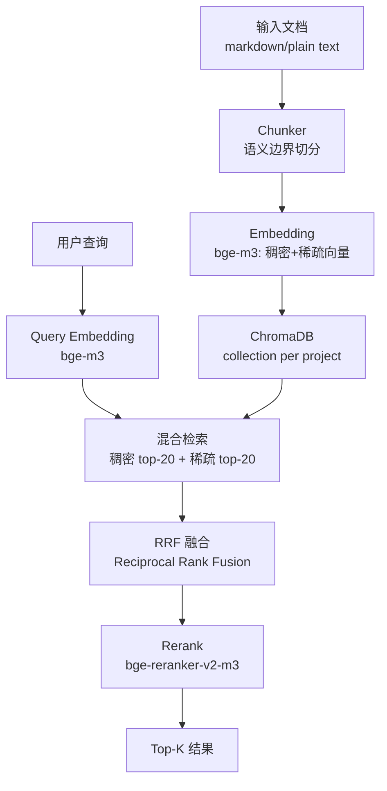
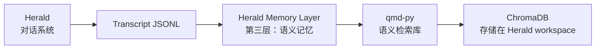

---
tags:
  - project
ownerKey: "project/qmd-py — Python 语义检索库"
creation date: 2026-02-18
status: planning
---

# qmd-py — Python 语义检索库

## 项目概览

**qmd-py** 是一个独立的 Python 语义检索库，灵感来自 [tobi/qmd](https://github.com/tobi/qmd)（TypeScript），用 Python 重写并适配中文科研场景。

它的设计目标是成为 [[Herald — AI Research Companion|Herald]] 的语义记忆后端，但完全解耦——可独立使用、独立发布到 PyPI。

### 为什么造这个轮子？

1. **tobi/qmd 是 TypeScript**，Herald 是 Python，跨语言调用开销大
2. **中文科研场景需要专门优化**：bge-m3 对中英双语支持更好，reranker 也需针对中文优化
3. **混合检索（稠密+稀疏向量）+ Rerank** 是当前最优实践，但现有库要么太重（LlamaIndex），要么不支持稀疏向量
4. **完全可控的架构**：作为 Herald 核心记忆层，需要对每个环节（chunking、embedding、检索、rerank）有清晰掌控

### 当前状态

**规划阶段**

- 代码位置：pci-3 `/home/pci/ycz/Code/qmd-py/`（待创建）
- 参考项目：[tobi/qmd](https://github.com/tobi/qmd)（TypeScript 原版）
- 开发模式：独立库，先实现 MVP，再整合到 Herald

## 核心功能（MVP）

| 功能 | 方案 | 说明 |
|------|------|------|
| **Chunking** | 自实现 markdown 语义边界切分 | 借鉴 QMD 算法，900 tokens/chunk，15% 重叠；中文用字符数/1.5 估算 token |
| **Embedding** | bge-m3（FlagEmbedding） | 稠密+稀疏向量，中英双语支持优秀 |
| **向量存储** | ChromaDB + SQLite FTS5 | ChromaDB 存稠密向量，SQLite FTS5 存稀疏向量/全文索引 |
| **混合检索** | 稠密+稀疏 RRF 融合 | Reciprocal Rank Fusion，参考 QMD 实现 |
| **Rerank** | bge-reranker-v2-m3 | 中文场景精度最优 |
| **CLI** | typer / click | index / search / status 三个基本命令 |

## 技术选型

### 核心依赖

- **Python 3.11+**：异步支持 + 类型提示
- **Embedding**: `FlagEmbedding` 库 → bge-m3（同时输出稠密+稀疏向量）
- **Rerank**: `FlagEmbedding` 库 → bge-reranker-v2-m3
- **向量库**: ChromaDB（轻量、支持 collection 隔离）
- **Chunking**: 自实现（借鉴 tobi/qmd 的 markdown AST 解析 + 语义边界切分）
- **CLI**: typer（类型安全 + 自动生成帮助文档）

### 为什么不用现有方案？

| 方案 | 优点 | 缺点 | 结论 |
|------|------|------|------|
| LlamaIndex | 功能全、生态丰富 | **太重**，抽象层太多，难以精确控制 chunking 和检索逻辑 | ❌ 不适合 |
| LangChain | 生态丰富 | 同上，且版本迭代过快，稳定性存疑 | ❌ 不适合 |
| tobi/qmd 直接调用 | 原版实现成熟 | TypeScript → Python 跨语言调用开销大，且无法共享 embedding 模型 | ❌ 不适合 |
| 自己实现 | 完全可控，轻量，可定制 | 需要自己实现 chunking 和检索流水线 | ✅ **选这个** |

### 稀疏向量存储方案

ChromaDB 原生不支持稀疏向量，采用以下混合方案：
- **ChromaDB**：存储稠密向量（dense embeddings）
- **SQLite FTS5**：存储稀疏向量 + 全文检索索引
- **混合检索**：两路结果通过 RRF（Reciprocal Rank Fusion）融合

## 架构设计



### 核心流程

1. **索引阶段**：
   - Markdown 文档 → Chunker（900 tokens/chunk，15% 重叠；中文 token 估算用 `字符数 / 1.5`）
   - 每个 chunk → bge-m3 embedding（同时生成稠密向量 + 稀疏向量）
   - 稠密向量存入 ChromaDB，稀疏向量存入 SQLite FTS5

2. **检索阶段**：
   - 用户查询 → bge-m3 embedding
   - 稠密向量检索 top-20 + 稀疏向量检索 top-20
   - RRF 融合（`score = 1/(k + rank_dense) + 1/(k + rank_sparse)`，k=60）
   - Rerank（bge-reranker-v2-m3）→ 最终 top-K

### 模型加载策略

借鉴 tobi/qmd 的设计，采用懒加载 + 自动卸载机制：

- **懒加载**：模型在首次 `search`/`index` 调用时才加载，而非启动时加载
- **Idle Timeout**：默认 5 分钟空闲后自动卸载 contexts 释放显存（可配置）
- **两级卸载**：
  - 默认只卸载 contexts（释放大部分显存）
  - 可选完全卸载 models（释放所有显存）
- **保护机制**：有活跃请求时不卸载
- **GPU 选择**：自动检测 CUDA > MPS > CPU，失败时自动降级
- **模型缓存目录**：`~/.cache/qmd-py/models/`

## API 设计（初步）

```python
from qmd_py import QMDStore

# 初始化
store = QMDStore(
    path="./data",           # ChromaDB 存储路径
    model="bge-m3",          # embedding 模型
    reranker="bge-reranker-v2-m3"  # rerank 模型（可选）
)

# 索引文档
store.add(
    collection="my_project",
    doc_path="./docs/notes.md",
    metadata={"source": "obsidian", "tags": ["research"]}
)

# 检索
results = store.search(
    collection="my_project",
    query="multi-agent systems",
    top_k=5,
    rerank=True  # 是否启用 rerank
)

# 增量更新（重建索引）
store.update(
    collection="my_project",
    doc_path="./docs/notes.md"
)

# 删除 collection
store.delete_collection("my_project")
```

### CLI 接口

```bash
# 索引文档
qmd-py index my_project ./docs/notes.md

# 检索
qmd-py search my_project "multi-agent systems" --top-k 5 --rerank

# 查看状态
qmd-py status my_project
```

## 与 Herald 的关系



### 关键设计决策

1. **JSONL 索引流水线**（Herald 负责）：
   - **格式转换**：JSONL → plain text（过滤 user/assistant 消息，添加角色前缀）
   - **行号映射**：生成 lineMap（chunk → 原始 JSONL 行号）
   - **异步后台执行**：索引更新在后台运行，5 秒 debounce，不阻塞用户对话
   - **增量阈值**：64KB 或 10 条消息触发索引更新
   - **并发控制**：单例锁，同一时间只有一个索引任务
   - qmd-py 只接收 markdown/plain text，不知道 Herald 的存在

2. **ChromaDB 存储位置**：
   - 暂时放在 Herald workspace 下（`~/.herald/memory/`）
   - 未来可考虑独立存储服务

3. **完全解耦**：
   - qmd-py 是独立 Python 库，可单独发布到 PyPI
   - Herald 只是它的一个使用者
   - 其他项目也可以直接使用 qmd-py

## 参考项目

| 项目 | 借鉴内容 | 链接 |
|------|----------|------|
| **tobi/qmd** | chunking 算法、RRF 融合、混合检索架构 | https://github.com/tobi/qmd |
| **OpenClaw** | JSONL 索引流水线、增量更新策略、模型加载策略 | 内部项目 |
| **FlagEmbedding** | bge-m3、bge-reranker-v2-m3 使用最佳实践 | https://github.com/FlagOpen/FlagEmbedding |

## 里程碑 / 时间线

- **2026-02-18**: 项目立项，技术选型确定

## Tasks

- [ ] 研读 tobi/qmd 源码（重点：chunking 算法、RRF 融合） ⏳ 2026-02-25
- [ ] 搭建代码仓库 + 基础项目结构（pyproject.toml + 目录结构） ⏳ 2026-02-28
- [ ] 实现 Chunker（markdown 语义边界切分） ⏳ 2026-03-05
- [ ] 集成 bge-m3 embedding（稠密+稀疏向量） ⏳ 2026-03-10
- [ ] 实现 ChromaDB 存储层 ⏳ 2026-03-12
- [ ] 实现混合检索 + RRF 融合 ⏳ 2026-03-15
- [ ] 集成 bge-reranker-v2-m3 ⏳ 2026-03-18
- [ ] CLI 接口（typer） ⏳ 2026-03-20
- [ ] 单元测试 + 文档 ⏳ 2026-03-25

## Log

- 2026-02-18: 项目立项，技术选型确定（Python + bge-m3 + ChromaDB + RRF + reranker）
